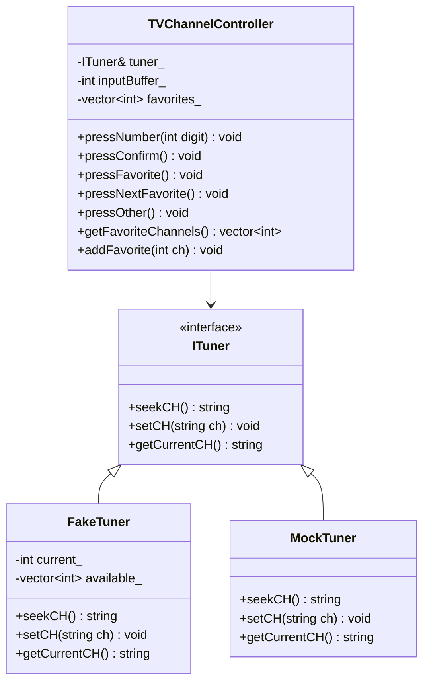
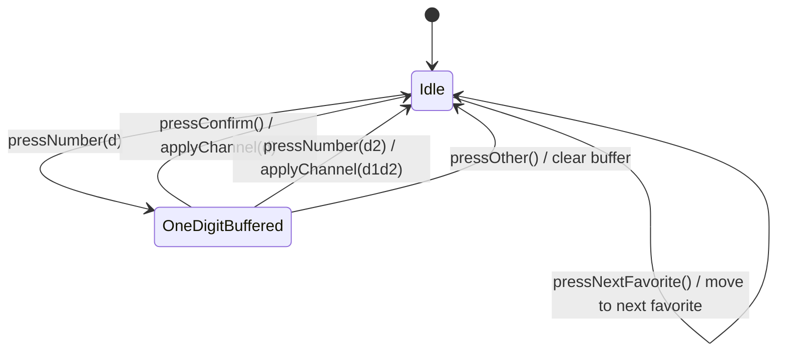

# TDD TV Channel Controller 코드베이스 분석

## 1. 프로젝트 전체 구조

이 프로젝트는 C++17, CMake, Google Test, Google Mock을 사용하는 TDD 연습용 TV 채널 컨트롤러 프로젝트이다. 현재 코드는 테스트 더블을 활용해 `TVChannelController`를 검증할 수 있도록 인터페이스와 Fake/Mock 구현을 분리한 구조를 가진다.

```text
TDD_TV_07/
├── CMakeLists.txt
├── README.md
├── include/
│   ├── ITuner.h
│   ├── FakeTuner.h
│   ├── MockTuner.h
│   └── TVChannelController.h
├── src/
│   └── TVChannelController.cpp
└── test/
    ├── FakeTunerTest.cpp
    ├── TVChannelControllerTest.cpp
    └── TVChannelControllerMockTest.cpp
```

### 빌드 및 테스트 구성

- `CMakeLists.txt`는 `tv_controller` 라이브러리를 만들고, 세 개의 테스트 실행 파일을 등록한다.
- `fake_tuner_test`는 `FakeTuner` 자체 동작을 검증하는 용도이다.
- `controller_test`는 `FakeTuner`를 사용해 `TVChannelController`의 상태 결과를 검증하는 용도이다.
- `controller_mock_test`는 `MockTuner`를 사용해 `TVChannelController`가 `ITuner`를 어떻게 호출하는지 검증하는 용도이다.

현재 `TVChannelController.cpp`와 테스트 파일들은 대부분 스텁 상태이다. 따라서 문서의 분석은 실제 구현된 코드와 README에 드러난 의도된 설계를 구분해서 설명한다.

## 2. 주요 클래스 역할과 책임

### `ITuner`

파일: `include/ITuner.h`

`ITuner`는 TV 채널 튜너가 제공해야 하는 최소 기능을 정의하는 순수 가상 인터페이스이다.

책임:

- 채널 검색: `seekCH()`
- 특정 채널 설정: `setCH(std::string ch)`
- 현재 채널 조회: `getCurrentCH()`

`TVChannelController`는 구체적인 튜너 구현을 직접 알지 않고 `ITuner` 인터페이스에만 의존한다. 이 구조 덕분에 실제 튜너 대신 `FakeTuner`, `MockTuner`를 주입해 테스트할 수 있다.

### `FakeTuner`

파일: `include/FakeTuner.h`

`FakeTuner`는 `ITuner`를 구현하는 상태 기반 테스트 더블이다. 실제 튜너처럼 내부 상태를 가지고 동작 결과를 반환한다.

주요 상태:

- `current_`: 현재 채널 번호
- `available_`: `seekCH()`가 탐색할 수 있는 채널 목록

책임:

- `setCH()` 호출 시 문자열 채널을 정수로 변환하고 `0~99` 범위인지 검증한다.
- 유효한 채널이면 `current_`를 변경한다.
- 범위를 벗어나면 `std::invalid_argument`를 던진다.
- `seekCH()` 호출 시 현재 채널보다 큰 다음 가용 채널로 이동한다.
- 더 큰 채널이 없으면 `available_`의 첫 번째 채널로 순환한다.
- `getCurrentCH()`는 현재 채널을 문자열로 반환한다.

주의할 점:

- `seekCH()`는 `available_`가 비어 있지 않다는 전제를 가진다. 빈 목록이면 `available_.front()` 접근이 위험하다.
- `available_`가 정렬되어 있어야 자연스러운 “다음 채널” 탐색이 된다. 현재 생성자에서는 정렬을 보장하지 않는다.

### `MockTuner`

파일: `include/MockTuner.h`

`MockTuner`는 Google Mock 기반의 행위 검증용 테스트 더블이다.

책임:

- `ITuner`의 세 메서드를 `MOCK_METHOD`로 선언한다.
- 테스트에서 `EXPECT_CALL`, `ON_CALL`, `InSequence` 등을 사용해 컨트롤러와 튜너 사이의 상호작용을 검증할 수 있게 한다.

검증에 적합한 항목:

- `setCH("12")`가 정확히 한 번 호출되는지
- 즐겨찾기 이동 시 `getCurrentCH()` 이후 `setCH()`가 호출되는지
- 즐겨찾기 목록이 비어 있을 때 `setCH()`가 호출되지 않는지

### `TVChannelController`

파일: `include/TVChannelController.h`, `src/TVChannelController.cpp`

`TVChannelController`는 사용자 입력을 받아 채널 변경과 선호 채널 관리를 수행하는 중심 클래스이다.

주요 의존성:

- `ITuner& tuner_`: 채널 변경과 현재 채널 조회를 위임하는 외부 튜너 인터페이스

주요 상태:

- `inputBuffer_`: 숫자 버튼 입력을 임시 저장하는 버퍼
- `favorites_`: 선호 채널 목록

공개 API:

- `pressNumber(int digit)`: 숫자 버튼 입력
- `pressConfirm()`: 입력 중인 채널 확정
- `pressFavorite()`: 현재 채널을 선호 채널에 추가하거나 제거
- `pressNextFavorite()`: 현재 채널 이후의 다음 선호 채널로 이동
- `pressOther()`: 다른 버튼 입력으로 숫자 입력 상태 취소
- `getFavoriteChannels()`: 선호 채널 목록 조회
- `addFavorite(int ch)`: 테스트나 사전 설정을 위한 선호 채널 추가

현재 상태:

- 헤더에는 상태와 책임이 정의되어 있지만, `src/TVChannelController.cpp`의 메서드 본문은 비어 있다.
- 따라서 실제 채널 변경, 입력 버퍼 처리, 선호 채널 토글, 다음 선호 채널 이동은 아직 구현되지 않았다.

## 3. 클래스 간 의존성 관계

### 의존성 요약



### 핵심 구조

`TVChannelController`는 `FakeTuner`나 `MockTuner`를 직접 의존하지 않는다. 생성자에서 `ITuner&`를 받기 때문에 런타임에 어떤 튜너 구현이든 주입할 수 있다.

```cpp
explicit TVChannelController(ITuner& t) : tuner_(t) {}
```

이 구조는 의존성 역전 원칙을 따르는 형태이다. 상위 정책에 해당하는 컨트롤러가 하위 구현체가 아니라 추상화인 `ITuner`에 의존한다.

### 테스트 관점의 의존성

- `TVChannelControllerTest.cpp`는 `TVChannelController`와 `FakeTuner`를 함께 사용한다.
- `TVChannelControllerMockTest.cpp`는 `TVChannelController`와 `MockTuner`를 함께 사용한다.
- `FakeTunerTest.cpp`는 `FakeTuner`만 독립적으로 검증한다.

즉, 컨트롤러는 동일한 생산 코드이지만 테스트 목적에 따라 서로 다른 테스트 더블을 주입받는다.

## 4. State 패턴 구현 방식

### 현재 코드의 상태

현재 코드에는 GoF의 전통적인 State 패턴, 즉 `State` 인터페이스와 여러 `ConcreteState` 클래스로 상태별 동작을 분리하는 구조는 구현되어 있지 않다.

대신 상태 기반 동작을 위해 각 클래스가 내부 필드를 직접 보유한다.

- `TVChannelController::inputBuffer_`: 숫자 입력 진행 상태
- `TVChannelController::favorites_`: 선호 채널 목록 상태
- `FakeTuner::current_`: 현재 튜너 채널 상태
- `FakeTuner::available_`: 탐색 가능한 채널 목록 상태

따라서 이 프로젝트의 현재 상태 관리는 “State 패턴”이라기보다 “상태를 가진 객체의 조건 분기 기반 구현”에 가깝다.

### 의도된 컨트롤러 상태 흐름

README의 테스트 명세를 기준으로 보면 `TVChannelController`는 다음과 같은 상태 흐름을 의도한다.



상태별 의미:

- `Idle`: 숫자 입력 버퍼가 비어 있는 상태이다. 현재 코드에서는 `inputBuffer_ == -1`로 표현된다.
- `OneDigitBuffered`: 숫자 하나가 입력되어 확정을 기다리는 상태이다. 현재 코드에서는 `inputBuffer_`에 `0~9` 값이 저장되는 형태로 표현될 수 있다.
- 두 자리 입력이 완성되면 즉시 채널을 적용하고 다시 `Idle` 상태로 돌아가는 흐름이 의도되어 있다.

### 현재 설계의 장단점

장점:

- 상태 클래스가 따로 없어 구조가 단순하다.
- 현재 요구사항처럼 입력 상태가 작고 단순한 경우 구현 비용이 낮다.
- `inputBuffer_ == -1`이라는 센티넬 값만으로 대기 상태를 표현할 수 있다.

단점:

- 입력 상태가 늘어나면 조건문이 복잡해질 가능성이 있다.
- `-1`의 의미가 코드 전반에 흩어지면 가독성이 떨어질 수 있다.
- 상태별 행동을 독립적으로 테스트하기 어렵다.

요구사항이 현재 수준에 머문다면 별도의 State 패턴 클래스를 도입할 필요는 낮다. 다만 입력 모드가 늘어나거나 버튼별 동작이 상태에 따라 크게 달라진다면 `InputState` 같은 추상 상태를 도입하는 리팩토링을 고려할 수 있다.

## 5. Test Double 사용 패턴

이 프로젝트는 동일한 `ITuner` 인터페이스를 두 종류의 테스트 더블로 대체하는 구조를 가진다.

### Fake 사용 패턴

사용 파일:

- `include/FakeTuner.h`
- `test/FakeTunerTest.cpp`
- `test/TVChannelControllerTest.cpp`

`FakeTuner`는 실제 동작에 가까운 간단한 구현체이다. 내부 상태를 가지며 `setCH()`, `seekCH()`, `getCurrentCH()`가 실제처럼 동작한다.

적합한 검증:

- 채널을 변경한 뒤 최종 상태가 기대와 같은지 확인
- 즐겨찾기 이동 후 현재 채널이 기대값인지 확인
- 범위 밖 채널 입력 시 예외가 발생하는지 확인
- 여러 입력을 순서대로 수행한 뒤 누적 상태가 올바른지 확인

예상 테스트 스타일:

```cpp
FakeTuner tuner({1, 4, 12, 56});
TVChannelController ctrl(tuner);

ctrl.pressNumber(1);
ctrl.pressNumber(2);

EXPECT_EQ("12", tuner.getCurrentCH());
```

이 방식은 구현 내부 호출 횟수보다 사용자가 관찰할 수 있는 결과를 중심으로 검증한다.

### Mock 사용 패턴

사용 파일:

- `include/MockTuner.h`
- `test/TVChannelControllerMockTest.cpp`

`MockTuner`는 Google Mock을 사용해 상호작용을 검증하는 테스트 더블이다.

적합한 검증:

- 특정 메서드가 호출되는지
- 호출 횟수가 정확한지
- 호출 인자가 올바른지
- 호출 순서가 중요한지
- 특정 조건에서 호출이 발생하지 않는지

예상 테스트 스타일:

```cpp
MockTuner mockTuner;
TVChannelController ctrl(mockTuner);

EXPECT_CALL(mockTuner, setCH("12")).Times(1);

ctrl.pressNumber(1);
ctrl.pressNumber(2);
```

이 방식은 상태 결과보다 객체 간 협력 방식을 검증한다.

### Fake와 Mock의 역할 분담

| 구분 | FakeTuner | MockTuner |
| --- | --- | --- |
| 목적 | 상태 기반 검증 | 행위 기반 검증 |
| 구현 방식 | 직접 동작하는 간단한 대체 구현 | GMock 매크로 기반 |
| 검증 대상 | 최종 채널, 즐겨찾기 목록, 예외 | 호출 여부, 호출 횟수, 호출 순서, 인자 |
| 장점 | 사용자 관점의 결과 검증에 강함 | 컨트롤러와 튜너의 협력 검증에 강함 |
| 단점 | 내부 호출 방식은 검증하기 어려움 | 구현 세부사항에 테스트가 결합될 수 있음 |

### 현재 테스트 코드 상태

현재 테스트 파일들은 스텁 수준이다.

- `FakeTunerTest.cpp`는 초기 채널이 `"0"`인지 확인하는 테스트만 있다.
- `TVChannelControllerTest.cpp`는 컨트롤러 생성 후 튜너 초기 상태만 확인한다.
- `TVChannelControllerMockTest.cpp`는 `EXPECT_TRUE(true)`만 수행한다.

README에는 테스트해야 할 항목이 자세히 정리되어 있으므로, 실제 TDD 진행 시에는 README의 TO-DO를 기준으로 Fake 기반 상태 검증과 Mock 기반 행위 검증을 점진적으로 채워 넣으면 된다.

## 6. 구현상 주요 관찰 사항

### `TVChannelController.cpp`가 아직 미구현 상태

컨트롤러의 핵심 메서드가 모두 빈 본문이다.

- `pressNumber(int digit)`
- `pressConfirm()`
- `pressFavorite()`
- `pressNextFavorite()`
- `pressOther()`
- `applyChannel(int ch)`

따라서 현재 시점에서는 컨트롤러의 실제 런타임 동작보다 헤더에 선언된 상태와 README의 테스트 명세가 설계 분석의 주요 근거가 된다.

### `favorites_`는 정렬된 목록으로 관리하려는 의도가 있다

`addFavorite(int ch)`는 중복을 방지하고 추가 후 `std::sort()`를 호출한다. 이는 `pressNextFavorite()` 구현 시 현재 채널보다 큰 첫 번째 선호 채널을 찾고, 없으면 처음으로 순환하는 방식과 잘 맞는다.

예상 구현에는 `std::upper_bound()`가 적합하다.

### `applyChannel(int ch)`는 채널 적용 책임을 모으는 훅이다

`applyChannel()`은 private 메서드로 선언되어 있다. 의도된 책임은 다음과 같다.

- 채널 번호 유효성 검증
- 유효하지 않은 채널에 대한 예외 처리
- 유효한 채널을 `tuner_.setCH()`로 전달
- 입력 버퍼 초기화와의 연계

현재는 빈 본문이지만, 컨트롤러 내 채널 변경 경로를 한 곳으로 모으기 위한 설계 포인트로 볼 수 있다.

## 7. 개선 제안

### 단기 개선

- README의 테스트 목록을 기준으로 실패하는 테스트부터 작성한다.
- `TVChannelController.cpp`의 빈 메서드를 테스트가 요구하는 만큼만 구현한다.
- `inputBuffer_ == -1`의 의미를 명확히 하기 위해 `static constexpr int EmptyInput = -1;` 같은 상수를 도입한다.
- `pressNumber()`에서 `0~9` 외 입력을 어떻게 처리할지 정책을 명확히 한다.

### 테스트 보강

- `FakeTunerTest.cpp`에서 채널 범위 경계값 `0`, `99`, `-1`, `100`을 검증한다.
- `seekCH()`의 wrap-around를 검증한다.
- `TVChannelControllerTest.cpp`에서 숫자 입력, 확정, 취소, 즐겨찾기 토글, 다음 즐겨찾기를 상태 기반으로 검증한다.
- `TVChannelControllerMockTest.cpp`에서 `setCH()`, `getCurrentCH()` 호출 여부와 순서를 검증한다.

### 설계 개선

- 현재 요구사항에서는 별도의 State 패턴 클래스를 도입하지 않아도 충분하다.
- 상태가 늘어나면 `inputBuffer_` 중심의 조건 분기를 `InputState` 또는 명시적 enum 상태로 분리하는 것을 고려할 수 있다.
- `FakeTuner` 생성자에서 `available_` 정렬 또는 비어 있는 목록 방어 정책을 정하면 테스트 신뢰성이 높아진다.
