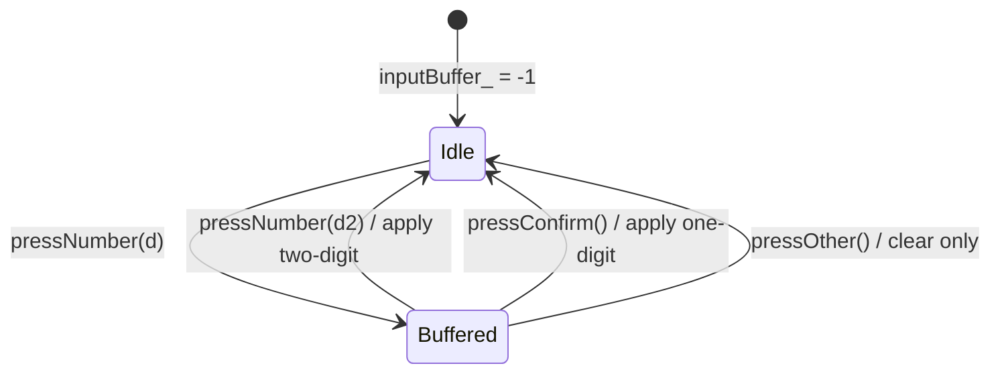

# TDD TV Channel Controller — 요구사항 분석 (C++ / 테스트 관점)

| 항목 | 내용 |
|------|------|
| 기준 문서 | `README.md`, `include/*.h`, `src/TVChannelController.cpp` (현재 스텁) |
| 기술 스택 | C++17, CMake, Google Test / GMock |
| Test Double | `FakeTuner` (상태 기반), `MockTuner` (행위 기반) |
| 작성 관점 | 시니어 C++ QA — 구현·단위 테스트 설계용 명세 |

---

## 1. 기능 영역별 비즈니스 규칙

### 1.1 기능 1 — 숫자 입력·확정 (`pressNumber`, `pressConfirm`, `pressOther`)

| ID | 조건 / 입력 | 기대 동작 | 검증 포인트 |
|----|-------------|-----------|-------------|
| F1-01 | `inputBuffer_ == -1` 상태에서 `pressNumber(d)` (`d` ∈ 0~9) | `inputBuffer_ = d` 저장. **즉시 채널 적용 없음** | `getCurrentCH()` 변화 없음 |
| F1-02 | 한 자리 버퍼 상태에서 `pressNumber(d2)` | `next = inputBuffer_ * 10 + d2`. `0 ≤ next ≤ 99`이면 `applyChannel(next)` 후 `inputBuffer_ = -1` | README: `1`+`2` → `"12"` (확정 없이 적용) |
| F1-03 | 한 자리 버퍼 상태에서 `pressConfirm()` | `applyChannel(inputBuffer_)` 후 `inputBuffer_ = -1` | README: `1`+확정 → `"1"` |
| F1-04 | 연속 4자리 입력 `1,2,3,4` | `12` 적용 후 버퍼 리셋 → `3` 버퍼 → `34` 적용 | 두 자리 완성마다 즉시 적용·버퍼 초기화 |
| F1-05 | `pressOther()` | `inputBuffer_ = -1`만 수행. `tuner_.setCH` **미호출** | 버퍼 무효화; 튜너 채널은 Other 직전 값 유지 |
| F1-06 | `0` 후 `7` 입력 | `07` → 정수 **7**로 해석·적용 | `getCurrentCH() == "7"` (선행 0은 수치로 소멸) |
| F1-07 | 채널 `0` 입력 | `0` 단독(확정) 또는 `00`/`0x` 조합이 유효 범위면 정상 적용 | 경계 최솟값 |
| F1-08 | 채널 `99` 입력 | `9`+`9` 또는 `99` 조합으로 정상 적용 | 경계 최댓값 |
| F1-09 | 조합 결과 `> 99` (예: `1`,`0`,`0` → 100) | `applyChannel` 경로에서 `std::invalid_argument` 전파 | FakeTuner `setCH`와 동일 예외 계약 |
| F1-10 | `pressConfirm()` 시 `inputBuffer_ == -1` | 무동작 (또는 적용 없음) | 빈 버퍼 확정은 안전 무시 |

**입력 상태 요약**

| `inputBuffer_` | 의미 |
|----------------|------|
| `-1` | Idle — 입력 대기 |
| `0~9` | 한 자리가 버퍼됨 — 두 번째 숫자 또는 `pressConfirm` 대기 |



---

### 1.2 기능 2 — 선호 채널 토글 (`pressFavorite`)

| ID | 조건 / 입력 | 기대 동작 | 검증 포인트 |
|----|-------------|-----------|-------------|
| F2-01 | 현재 채널이 `favorites_`에 **없음** | `tuner_.getCurrentCH()`로 현재 채널 조회 후 목록에 **추가** | `addFavorite`와 동일: push + `std::sort` |
| F2-02 | 현재 채널이 `favorites_`에 **있음** | 목록에서 **삭제** (토글) | 등록 → 재누르면 제거 |
| F2-03 | 시퀀스 `12→★ 08→★ 37→★ 08→★ 06→★` | 최종 `{6, 12, 37}` (오름차순) | `08` 재토글로 8 제거 |
| F2-04 | `getFavoriteChannels()` | 항상 **오름차순** 정렬된 `const std::vector<int>&` | 정렬 불변식 |

**구현 메모:** `pressFavorite()`는 현재 채널을 `std::stoi(tuner_.getCurrentCH())` 등으로 얻어 `favorites_`를 직접 갱신한다. `addFavorite(int)`는 테스트 Arrange용 공개 API이며, 리팩토링 시 `addToFavorites()` 등으로 내부 로직과 통합한다 (README dev/refactoring).

---

### 1.3 기능 3 — 다음 선호 채널 (`pressNextFavorite`)

| ID | 조건 / 입력 | 기대 동작 | 검증 포인트 |
|----|-------------|-----------|-------------|
| F3-01 | `favorites_` 비어 있음 | **채널 변경 없음** (`setCH` 미호출) | Mock: `setCH` Times(0) |
| F3-02 | `favorites_ = {1,4,12,56}`, 현재 `6` | `12`로 이동 (현재보다 큰 **첫** 선호) | `upper_bound` 패턴 |
| F3-03 | 동일 목록, 현재 `56` | `1`로 이동 (**wrap-around**) | 끝 다음 → 최소 선호 |
| F3-04 | 현재 채널이 목록에 없음 | 현재보다 큰 첫 선호; 없으면 wrap → `favorites_.front()` | 목록 외 값 처리 |
| F3-05 | 목록 원소 1개 | `pressNextFavorite()` → 동일 채널로 wrap (유일 항목) | 단일 원소 wrap |
| F3-06 | 이동 시 | `getCurrentCH()` → 다음 채널 결정 → `setCH(std::to_string(next))` | Mock: 호출 **순서** 검증 |

**다음 선호 선택 알고리즘 (의도)**

1. `current = stoi(tuner_.getCurrentCH())`
2. `it = upper_bound(favorites_.begin(), favorites_.end(), current)`
3. `next = (it != favorites_.end()) ? *it : favorites_.front()`
4. `applyChannel(next)` 또는 `tuner_.setCH(to_string(next))`

---

### 1.4 FakeTuner — `ITuner` 테스트 더블 (상태 기반)

| ID | 메서드 | 규칙 | 예외 / 경계 |
|----|--------|------|-------------|
| FT-01 | `setCH(ch)` | `v = stoi(ch)`; `0 ≤ v ≤ 99`이면 `current_ = v` | `v < 0` 또는 `v > 99` → `std::invalid_argument` (메시지에 `ch` 포함) |
| FT-02 | `getCurrentCH()` | `std::to_string(current_)` 반환 | 선행 0 없음 (`7` not `"07"`) |
| FT-03 | `seekCH()` | `available_`에서 `current_`보다 큰 **첫** 채널로 이동 | 연속 호출 시 항상 `0~99` |
| FT-04 | `seekCH()` wrap | 더 큰 채널 없으면 `available_.front()` | 목록 끝 → 처음 |
| FT-05 | 초기 상태 | `current_ = 0` (기본값) | 테스트 Arrange 시 명시적 `setCH` 권장 |
| FT-06 | `available_` | 비어 있지 않다는 전제 (과제 시나리오) | 빈 벡터 시 `front()` UB — 테스트에서 방지 |

---

### 1.5 MockTuner — 행위 기반 검증 관점

| ID | 시나리오 | 기대 상호작용 | GMock 패턴 |
|----|----------|---------------|------------|
| MK-01 | `pressNumber(1)` + `pressConfirm()` | `setCH("1")` **정확히 1회** | `EXPECT_CALL(..., setCH("1")).Times(1)` |
| MK-02 | `pressNumber(1)` + `pressNumber(2)` | `setCH("12")` **1회** (확정 없음) | 인자 일치 |
| MK-03 | `pressFavorite()` | `getCurrentCH()` **호출됨** | `Times(AtLeast(1))` |
| MK-04 | `pressNextFavorite()` (목록 있음) | `getCurrentCH()` **후** `setCH(...)` 순서 | `InSequence` |
| MK-05 | `pressNextFavorite()` (목록 비움) | `setCH` **미호출** | `Times(0)` |
| MK-06 | 일반 | `seekCH`는 컨트롤러 시나리오에서 **기대하지 않음** | 불필요 호출 없음 확인 |

**Mock 테스트 원칙:** 상태 결과(`getCurrentCH` 최종값)보다 **협력 계약**(호출 여부·횟수·인자·순서)을 검증한다. `ON_CALL`로 기본 반환값을 두고, 검증 대상만 `EXPECT_CALL`로 명시한다.

---

## 2. 채널 문자열·정수 변환·분기 시 주의점

| 주제 | 규칙 / 주의 |
|------|-------------|
| 유효 채널 범위 | 정수 **0~99** (양 끝 포함). `100`, `-1`은 무효 |
| `std::stoi` | `FakeTuner::setCH`, 컨트롤러의 `getCurrentCH()` 역변환에 사용. 비숫자 문자열은 과제 범위 외이나, 테스트에서는 `"0"`~`"99"`만 사용 |
| `std::to_string` | 선행 0 미보존 (`7` not `"07"`). README 기대 문자열과 일치 |
| 선행 0 입력 | `0`,`7` → 산술값 `7`. 표시는 `"7"` |
| 두 자리 즉시 적용 | 두 번째 `pressNumber`로 `next` 계산·적용 시 **확정 불필요** |
| 한 자리 확정 | 버퍼에 한 자리만 있을 때 `pressConfirm`으로 적용 |
| `inputBuffer_` 센티넬 | `-1` = 빈 버퍼. `0`은 유효한 **채널 숫자**이지 “빈” 상태가 아님 |
| `applyChannel(int ch)` | 단일 진입점: `isValidChannel(ch)` → `tuner_.setCH(to_string(ch))`. 무효 시 `invalid_argument` (FakeTuner와 동일) |
| 버퍼 vs 튜너 | `pressOther`·무효 조합은 **버퍼만** 초기화; 이미 적용된 채널은 롤백하지 않음 |
| README T-10 (`4,5,6`+Other) | `4`,`5`로 `45` 즉시 적용 → `6`만 버퍼 → `pressOther` → **45 유지**, `6` 미적용 |

---

## 3. 예외·경계값·상태 조건

### 3.1 예외

| 조건 | 발생 위치 | 예외 타입 |
|------|-----------|-----------|
| `setCH("-1")`, `setCH("100")` | `FakeTuner::setCH` | `std::invalid_argument` |
| 컨트롤러에서 채널 `100` 이상 입력·적용 시도 | `applyChannel` → `tuner_.setCH` | `std::invalid_argument` (전파) |
| `stoi` 실패 문자열 | 과제 범위 외 | — |

### 3.2 경계값

| 구분 | 값 | 기대 |
|------|-----|------|
| 최소 유효 채널 | `0` | 정상 설정 |
| 최대 유효 채널 | `99` | 정상 설정 |
| 무효 하한 | `-1` | 예외 |
| 무효 상한 | `100` | 예외 |
| 숫자 버튼 | `0~9` | `pressNumber` 인자 (범위 외는 무동작 또는 방어 코드) |
| `inputBuffer_` | `-1` | Idle |
| `favorites_` | `{}` | `pressNextFavorite` 무동작 |
| `favorites_` | 1개 | wrap-around 동일 채널 |
| `seekCH` wrap | `available_` 마지막 이후 | `available_.front()` |

### 3.3 상태 조건 체크리스트

1. 두 자리 완성 직후 `inputBuffer_ == -1`
2. `pressConfirm` / `pressOther` / 두 자리 적용 후 버퍼 클리어
3. `favorites_` 추가·삭제 후에도 정렬 유지
4. `pressFavorite`는 튜너 현재 채널 기준 (컨트롤러가 채널을 바꾸지 않음)
5. Mock: 빈 즐겨찾기에서 `setCH` 0회

---

## 4. Test Double 사용 규칙 명세

### 4.1 역할 분담

| 구분 | FakeTuner | MockTuner |
|------|-----------|-----------|
| 파일 | `include/FakeTuner.h`, `test/FakeTunerTest.cpp`, `test/TVChannelControllerTest.cpp` | `include/MockTuner.h`, `test/TVChannelControllerMockTest.cpp` |
| 검증 스타일 | **상태 기반** — 최종 `getCurrentCH()`, `getFavoriteChannels()` | **행위 기반** — `EXPECT_CALL`, 호출 순서 |
| 구현 | 동작하는 간이 튜너 (`current_`, `available_`) | `MOCK_METHOD` 3개 (`seekCH`, `setCH`, `getCurrentCH`) |
| 적합 시나리오 | 입력·즐겨찾기·예외·wrap 결과 | `setCH` 횟수, `getCurrentCH`/`setCH` 순서, 미호출 |

### 4.2 FakeTuner 사용 규칙

1. **Arrange:** `FakeTuner tuner({...});` `TVChannelController ctrl(tuner);`
2. **Act:** 컨트롤러 public API 호출
3. **Assert:** `tuner.getCurrentCH()` 또는 `ctrl.getFavoriteChannels()`
4. 경계·예외는 Fake 단독 테스트(`FakeTunerTest`)와 컨트롤러 통합 테스트 모두에서 커버
5. `seekCH` wrap은 `available_` 순서에 의존 — 테스트 데이터는 **정렬된** 채널 목록 사용 권장

### 4.3 MockTuner 사용 규칙

1. `using ::testing::_;` / `InSequence` / `Times` / `AtLeast` 적절히 사용
2. **검증 대상 호출만** `EXPECT_CALL`; 나머지는 `ON_CALL`로 기본값 (`getCurrentCH` → `"0"` 등)
3. **호출 순서**가 명세인 경우 (`pressNextFavorite`): `InSequence seq;` 후 순차 `EXPECT_CALL`
4. **미호출** 검증: `EXPECT_CALL(mock, setCH(_)).Times(0);` 또는 해당 expectation 없음 + `Mock::VerifyAndClearExpectations`
5. Mock 테스트는 **컨트롤러–튜너 계약**만 검증; 즐겨찾기 목록 내용은 Fake 테스트에 맡김

### 4.4 ITuner (수정 불가)

- 프로덕션·테스트 모두 `ITuner&`에 의존 (`TVChannelController`는 `FakeTuner`/`MockTuner` 타입을 알지 않음)
- `ITuner.h` **수정 금지** — 계약 변경 시 전체 테스트 영향

---

## 5. Google Test 기준 테스트 시나리오 목록

README TO-DO 전 항목(28건)을 테스트 파일·번호 순으로 정리한다. 현재 저장소는 스텁만 존재하며, 아래 번호가 TDD Red 단계의 공식 체크리스트이다.

### 5.1 FakeTunerTest.cpp (6건)

| No | 테스트 의도 | Arrange / Act | Assert |
|----|-------------|---------------|--------|
| T-01 | 최솟값 경계 | `setCH("0")` | `getCurrentCH() == "0"` |
| T-02 | 최댓값 경계 | `setCH("99")` | `getCurrentCH() == "99"` |
| T-03 | 무효 하한 | `setCH("-1")` | `EXPECT_THROW(..., std::invalid_argument)` |
| T-04 | 무효 상한 | `setCH("100")` | `EXPECT_THROW(..., std::invalid_argument)` |
| T-05 | seek 연속 유효성 | `seekCH()` 연속 호출 | 반환·상태가 항상 0~99 |
| T-06 | seek wrap-around | 목록 끝까지 seek 후 한 번 더 | 첫 `available_` 채널로 순환 |

### 5.2 TVChannelControllerTest.cpp — 기능 1 (8건)

| No | 테스트 의도 | Act | Assert |
|----|-------------|-----|--------|
| T-07 | 한 자리 + 확정 | `pressNumber(1)`, `pressConfirm()` | `getCurrentCH() == "1"` |
| T-08 | 두 자리 즉시 | `pressNumber(1)`, `pressNumber(2)` | `getCurrentCH() == "12"` |
| T-09 | 연속 두 번의 두 자리 | `1,2,3,4` | `"12"` 후 `"34"` |
| T-10 | 버퍼 무효화 | `4,5,6`, `pressOther()` | `"45"` 유지 (`6` 미적용) |
| T-11 | 선행 0 | `0`, `7` | `getCurrentCH() == "7"` |
| T-12 | 채널 0 | `pressNumber(0)`, `pressConfirm()` (초기 `"0"`에서) | `getCurrentCH() == "0"` |
| T-13 | 채널 99 | `pressNumber(9)`, `pressNumber(9)` | `getCurrentCH() == "99"` |
| T-14 | 채널 100+ | `pressNumber(1)`, `pressNumber(0)`, `pressNumber(0)` | `EXPECT_THROW(..., std::invalid_argument)` |

### 5.3 TVChannelControllerTest.cpp — 기능 2 (4건)

| No | 테스트 의도 | Act | Assert |
|----|-------------|-----|--------|
| T-15 | 미등록 토글 추가 | 현재 채널에서 `pressFavorite()` | 목록에 포함 |
| T-16 | 등록 토글 삭제 | 등록 후 `pressFavorite()` | 목록에서 제거 |
| T-17 | 복합 시퀀스 | `12→★ 08→★ 37→★ 08→★ 06→★` | `{6, 12, 37}` |
| T-18 | 정렬 불변식 | 여러 번 추가 | `getFavoriteChannels()` 오름차순 |

### 5.4 TVChannelControllerTest.cpp — 기능 3 (5건)

| No | 테스트 의도 | Arrange | Act / Assert |
|----|-------------|---------|--------------|
| T-19 | 다음 선호 (중간) | fav `{1,4,12,56}`, 현재 `6` | `pressNextFavorite()` → `"12"` |
| T-20 | wrap (끝) | 동일, 현재 `56` | → `"1"` |
| T-21 | 빈 목록 | `favorites_` 비움 | 채널 변화 없음 |
| T-22 | 목록 외 현재 | 현재 ∉ favorites | 다음 큰 선호 또는 wrap |
| T-23 | 단일 원소 wrap | fav 1개 | wrap-around 동작 |

### 5.5 TVChannelControllerMockTest.cpp (5건)

| No | 테스트 의도 | Expectation |
|----|-------------|-------------|
| T-24 | 확정 시 setCH 1회 | `pressNumber(1)`+`pressConfirm()` → `setCH("1")` Times(1) |
| T-25 | 두 자리 setCH 1회 | `pressNumber(1,2)` → `setCH("12")` Times(1) |
| T-26 | 즐겨찾기 현재 조회 | `pressFavorite()` → `getCurrentCH()` 호출 |
| T-27 | 다음 즐겨찾기 순서 | 목록 있을 때 `getCurrentCH` → `setCH` (InSequence) |
| T-28 | 빈 목록 미호출 | 목록 비움 → `setCH` 호출 없음 |

### 5.6 시나리오–파일 추적 요약

| 파일 | 건수 | 번호 |
|------|------|------|
| `FakeTunerTest.cpp` | 6 | T-01 ~ T-06 |
| `TVChannelControllerTest.cpp` | 17 | T-07 ~ T-23 |
| `TVChannelControllerMockTest.cpp` | 5 | T-24 ~ T-28 |
| **합계** | **28** | README TO-DO 테스트 항목 전체 |

### 5.7 번호 목록 (빠른 참조)

1. **T-01** `setCH("0")` → `"0"`
2. **T-02** `setCH("99")` → `"99"`
3. **T-03** `setCH("-1")` → `invalid_argument`
4. **T-04** `setCH("100")` → `invalid_argument`
5. **T-05** `seekCH()` 연속 → 항상 유효 채널
6. **T-06** `seekCH()` wrap-around
7. **T-07** `1` + Confirm → `"1"`
8. **T-08** `1`,`2` → `"12"`
9. **T-09** `1,2,3,4` → `"12"` then `"34"`
10. **T-10** `4,5,6` + Other → `"45"` (버퍼만 무효화)
11. **T-11** `0`,`7` → `"7"`
12. **T-12** 채널 `0` 정상
13. **T-13** 채널 `99` 정상
14. **T-14** 채널 `100+` → 예외
15. **T-15** 미등록 `pressFavorite` → 추가
16. **T-16** 등록 `pressFavorite` → 삭제
17. **T-17** 복합 토글 → `{6,12,37}`
18. **T-18** `getFavoriteChannels()` 정렬
19. **T-19** next fav: `6` → `"12"`
20. **T-20** next fav wrap: `56` → `"1"`
21. **T-21** 빈 favorites → 무동작
22. **T-22** 목록 외 현재 → upper_bound / wrap
23. **T-23** favorites 1개 → wrap
24. **T-24** Mock: Confirm → `setCH("1")` ×1
25. **T-25** Mock: `12` → `setCH("12")` ×1
26. **T-26** Mock: Favorite → `getCurrentCH()` 호출
27. **T-27** Mock: Next fav → `getCurrentCH` then `setCH`
28. **T-28** Mock: 빈 favorites → `setCH` 미호출

---

## 6. 구현·테스트 공통 계약 (`applyChannel`)

```cpp
// 의도된 책임 (TVChannelController.h / .cpp)
void TVChannelController::applyChannel(int ch) {
    if (!isValidChannel(ch))  // ch < 0 || ch > 99
        throw std::invalid_argument(...);  // 또는 tuner_에 위임
    tuner_.setCH(std::to_string(ch));
}
```

- `pressNumber` / `pressConfirm` / `pressNextFavorite`는 채널 변경 시 이 경로를 통한다.
- 리팩토링 브랜치: `clearBuffer()`, `findNextFavorite()`, `addToFavorites()` 추출 (README dev/refactoring).

---

## 7. 현재 코드베이스 상태 (참고)

| 구성요소 | 상태 |
|----------|------|
| `FakeTuner.h` | 경계 검증·`seekCH` wrap 구현 완료 |
| `MockTuner.h` | `MOCK_METHOD` 3개 선언 완료 |
| `TVChannelController.cpp` | public 메서드·`applyChannel` **스텁** |
| 테스트 3종 | 각 1개 스텁 테스트만 존재 — **T-01~T-28 미착수** |

본 문서는 README 명세와 헤더 설계를 기준으로 작성되었으며, TDD 진행 시 **T-01부터 Red → Green** 순으로 구현을 맞춘다.
