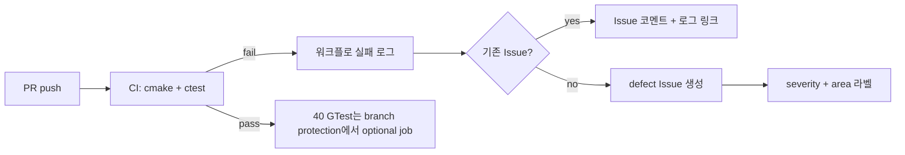

# 결함 관리 보고서 — TDD TV Channel Controller

| 항목 | 내용 |
|------|------|
| 단계 | Step 8 — 결함 관리 문서 |
| 역할 | QA 리드 |
| 작성 일시 | 2026-05-19 |
| 연계 문서 | [`docs/defect_list.md`](defect_list.md), [`docs/test_plan.md`](test_plan.md), [`docs/requirements_analysis.md`](requirements_analysis.md) |
| 프로젝트 | C++17 · Google Test / GMock · CMake · gcov/lcov |
| **오픈 결함** | **0건** |

---

## 1. 결함 분류 체계

### 1.1 Severity 정의

| Severity | 정의 | 대응 SLA (권장) | 예시 |
|----------|------|-----------------|------|
| **Critical** | 요구사항·안전 게이트 붕괴; 테스트가 Green으로 오인되거나 핵심 기능 전면 불가 | 즉시 차단·핫픽스 | Windows CTest 거짓 Pass (D-01) |
| **Major** | README·테스트 플랜 시나리오 불일치; 기능 단위 동작 오류 | 현 스프린트 내 수정 | 스텁 시대 채널/선호 미구현 (D-H01~H08) |
| **Minor** | 부수 경로·가독성·비핵심 엣지; 우회 가능 | 백로그 | (현재 미등록) |
| **Info** | 문서·메트릭·보고 해석 이슈; 코드 동작은 정상 | 문서/프로세스 개선 | ctest 28/28 vs 실제 검증 의미 (D-02) |

### 1.2 Area 정의

| Area | 범위 | 주요 테스트 자산 | 요구 ID (참고) |
|------|------|------------------|----------------|
| **FakeTuner** | `FakeTuner.h` — `setCH` 경계·예외, `seekCH` wrap | `fake_tuner_test` (6건) | FT-01~06 |
| **기능1(숫자입력)** | `pressNumber` / `pressConfirm` / `pressOther`, 버퍼·즉시 적용·예외 | `controller_test` 숫자 시나리오, Golden 채널 시나리오 | F1-01~08 |
| **기능2(선호토글)** | `pressFavorite`, 정렬된 `favorites_` | `controller_test` 선호 시나리오, Golden `favorites_*` | F2-01~04 |
| **기능3(다음선호)** | `pressNextFavorite`, wrap·빈 목록 | `controller_test` 다음 선호, Golden `next_favorite_*` | F3-01~05 |
| **Mock검증** | `ITuner` 호출 횟수·순서 (GMock) | `controller_mock_test` (5건) | M-01~05 |

> **전역(테스트·빌드 인프라):** CMake / CTest / CI 설정 결함은 Area 5종에 속하지 않으며, 매트릭스 **부록** 및 ID 접두 `D-` (히스토리: D-01, D-02)로 관리한다. 기능 회귀와 분리해 추적한다.

### 1.3 Severity × Area 매트릭스

#### 오픈 결함 (현재)

|  | FakeTuner | 기능1 | 기능2 | 기능3 | Mock검증 | **행 합계** |
|--|:---------:|:-----:|:-----:|:-----:|:--------:|:-----------:|
| **Critical** | 0 | 0 | 0 | 0 | 0 | **0** |
| **Major** | 0 | 0 | 0 | 0 | 0 | **0** |
| **Minor** | 0 | 0 | 0 | 0 | 0 | **0** |
| **Info** | 0 | 0 | 0 | 0 | 0 | **0** |
| **열 합계** | **0** | **0** | **0** | **0** | **0** | **0** |

| 전역(인프라) | Critical | Major | Minor | Info |
|--------------|:--------:|:-----:|:-----:|:----:|
| 오픈 | 0 | 0 | 0 | 0 |

#### 누적 발견·해결 (Step 4~5B 기준, 회귀 참고)

|  | FakeTuner | 기능1 | 기능2 | 기능3 | Mock검증 | **행 합계** |
|--|:---------:|:-----:|:-----:|:-----:|:--------:|:-----------:|
| **Critical** | 0 | 0 | 0 | 0 | 0 | **0** |
| **Major** | 0 | 6 | 1 | 1† | 1† | **6**‡ |
| **Minor** | 0 | 0 | 0 | 0 | 0 | **0** |
| **Info** | 0 | 0 | 0 | 0 | 0 | **0** |
| **열 합계** | **0** | **6** | **1** | **1** | **1** | **6**‡ |

† D-H08은 기능3 동작 + `setCH` Mock 검증이 동시에 실패 → Area별 각 1건으로 집계 (동일 ID).  
‡ 고유 Major 결함 ID는 **6건** (D-H01~H06 기능1, D-H07 기능2, D-H08 기능3/Mock).

| 전역(인프라) | Critical | Major | Minor | Info | 비고 |
|--------------|:--------:|:-----:|:-----:|:----:|------|
| 누적 (해결/정보) | 1 | 0 | 0 | 1 | D-01 해결, D-02 정보 |

### 1.4 ID·Severity·Area 매핑 (`defect_list.md` 연계)

| ID | Severity | Area | 상태 | `defect_list.md` |
|----|----------|------|------|------------------|
| D-01 | Critical | 전역(인프라) | 해결 | § D-01 |
| D-02 | Info | 전역(인프라) | 정보 | § D-02 |
| D-H01 | Major | 기능1 | 해결 | § D-H01 |
| D-H02 | Major | 기능1 | 해결 | § D-H02 |
| D-H03 | Major | 기능1 | 해결 | § D-H03 |
| D-H04 | Major | 기능1 | 해결 | § D-H04 |
| D-H05 | Major | 기능1 | 해결 | § D-H05 |
| D-H06 | Major | 기능1 | 해결 | § D-H06 |
| D-H07 | Major | 기능2 | 해결 | § D-H07 |
| D-H08 | Major | 기능3, Mock검증 | 해결 | § D-H08 |

**신규 결함 ID 규칙:** `D-` + 2자리 순번 (오픈·인프라), 히스토리 스텁 결함은 `D-H` + 2자리. Area는 위 5종 + 필요 시 `전역(인프라)` 태그.

---

## 2. 결함 보고서 템플릿

모든 결함은 아래 필드를 채워 [`docs/defect_list.md`](defect_list.md) 요약 테이블·상세 절에 반영한다.

### 2.1 표준 템플릿

```markdown
### {ID} [{Severity}] [{Area}] — {한 줄 제목}

| 필드 | 내용 |
|------|------|
| **ID** | {D-XX / D-HXX} |
| **Severity** | Critical / Major / Minor / Info |
| **Area** | FakeTuner / 기능1 / 기능2 / 기능3 / Mock검증 / 전역(인프라) |
| **상태** | Open / In Progress / Resolved / Won't Fix / Info |
| **발견 단계** | step-4 / step-5A / step-5B / step-6 / step-7 |
| **관련 요구·테스트** | {F1-xx, T-xx, Golden 시나리오명} |
| **재현 (Steps)** | 1. … 2. … |
| **기대 (Expected)** | … |
| **실제 (Actual)** | … (실패 메시지·로그 인용) |
| **원인 (Root Cause)** | … |
| **수정 (Fix)** | 커밋·파일·요약 |
| **검증 (Verification)** | 실행한 테스트·결과 (통과율) |
| **회귀 위험** | 영향 Area, Golden/ Mock 여부 |
```

### 2.2 작성 예시 — 오픈 결함용 (빈 템플릿)

```markdown
### D-XX [Major] [기능1(숫자입력)] — {제목}

| 필드 | 내용 |
|------|------|
| **재현** | `pressNumber(...)` → … |
| **기대** | `getCurrentCH() == "…"` |
| **실제** | `EXPECT_EQ` 실패: … |
| **원인** | … |
| **수정** | `TVChannelController.cpp` L… |
| **검증** | `controller_test` 17/17, `golden_test` 12/12, `ctest` 4/4 |
```

### 2.3 대표 결함 카드 (템플릿 적용본)

#### D-01 [Critical] [전역(인프라)]

| 필드 | 내용 |
|------|------|
| **재현** | `cmake --build build` → `ctest --test-dir build` (수정 전 `gtest_discover_tests` per-case) |
| **기대** | GTest 28건 각각 assert 실행 |
| **실제** | `Running 0 tests from 0 test suites` ×28, ctest **Passed** |
| **원인** | 한글 테스트명 `--gtest_filter` → Windows CTest 인코딩 손상 |
| **수정** | `CMakeLists.txt`: WIN32 시 executable 단위 `add_test` 4건 |
| **검증** | ctest 4/4; 직접 exe 합계 40/40 (6+17+5+12) |

#### D-H06 [Major] [기능1(숫자입력)]

| 필드 | 내용 |
|------|------|
| **재현** | `pressNumber(1)` → `0` → `0` |
| **기대** | `std::invalid_argument` |
| **실제** | 예외 없음 |
| **원인** | 채널 100+·세 번째 자리 검사 부재 (스텁) |
| **수정** | `next > 99` throw, `inputBuffer_==10` 처리 |
| **검증** | `controller_test` 해당 케이스 Pass; Golden `exception_channel_100` |

상세·나머지 ID는 [`docs/defect_list.md`](defect_list.md) § 결함 상세를 SSOT로 유지한다. 본 문서는 **분류·메트릭·프로세스**를 정의한다.

---

## 3. 품질 메트릭 수집 계획

### 3.1 테스트 통과율

#### 측정 단위

| Executable | GTest 건수 | Area 커버리지 | 수집 명령 |
|------------|:----------:|---------------|-----------|
| `fake_tuner_test` | 6 | FakeTuner | `.\build\fake_tuner_test.exe` |
| `controller_test` | 17 | 기능1~3 (상태) | `.\build\controller_test.exe` |
| `controller_mock_test` | 5 | Mock검증 | `.\build\controller_mock_test.exe` |
| `golden_test` | 12 | 기능1~3 E2E 스냅샷 | `.\build\golden_test.exe` |
| **합계** | **40** | — | — |

#### 통과율 공식

```
통과율(executable) = Passed_tests / Total_tests × 100%
통과율(전체)       = Σ Passed / 40 × 100%
ctest 통과율       = Passed_ctest / 4 × 100%   (Windows: executable 4건)
```

#### 수집 주기·게이트

| 시점 | 최소 게이트 | 기록 위치 |
|------|-------------|-----------|
| 커밋 전 (로컬) | 4 exe 직접 실행 **40/40** | 개발자 로그 |
| PR / push | `ctest --test-dir build --output-on-failure` **4/4** | CI 아티팩트 |
| Step 7 리팩토링 각 Phase | 동일 + `golden_test` 스냅샷 diff 없음 | `docs/refactoring_plan.md` 체크리스트 |
| Step 9 QA 종료 | 통과율 100% + 커버리지 게이트 | `Report/` 최종 보고 |

#### 기준선 스냅샷 (2026-05-19)

| 메트릭 | 값 |
|--------|-----|
| `fake_tuner_test` | 6/6 (100%) |
| `controller_test` | 17/17 (100%) |
| `controller_mock_test` | 5/5 (100%) |
| `golden_test` | 12/12 (100%) |
| **전체 GTest** | **40/40 (100%)** |
| **ctest (Windows)** | **4/4 (100%)** |

```powershell
cmake --build build
ctest --test-dir build --output-on-failure
.\build\fake_tuner_test.exe
.\build\controller_test.exe
.\build\controller_mock_test.exe
.\build\golden_test.exe
```

> **주의 (D-02):** Windows에서 ctest **4/4**는 executable 단위이며, 내부 40 GTest를 대체하지 않는다. 품질 게이트는 **직접 exe 합계 40/40**을 SSOT로 한다.

### 3.2 코드 커버리지 (`tv_controller` 라이브러리)

| 항목 | 내용 |
|------|------|
| **대상** | `add_library(tv_controller …)` → `src/TVChannelController.cpp` (+ 인라인 헤더 분기) |
| **목표** | README · 테스트 플랜: 라인 **≥ 80%** (권장 **≥ 90%**) |
| **도구** | gcov + lcov (`ENABLE_COVERAGE` CMake 옵션, GCC/MinGW/WSL) |
| **제외** | `test/*`, googletest, 시스템 헤더 (`lcov --remove`) |
| **현재** | **미측정** (Step 7 Phase 10 / Step 9 전 게이트) |

#### lcov 파이프라인 (권장)

```bash
cmake -B build -DENABLE_COVERAGE=ON
cmake --build build
ctest --test-dir build
lcov --capture --directory build --output-file coverage.info
lcov --remove coverage.info '/usr/*' '*/test/*' '*/googletest/*' '*/build/_deps/*' \
     --output-file coverage.filtered.info
genhtml coverage.filtered.info --output-directory build/coverage_html
```

**Windows MSVC:** gcov 미지원 → WSL/MinGW 빌드 또는 OpenCppCoverage. 과제 SSOT는 README gcov/lcov.

#### 커버리지 개선 루프

1. HTML에서 미커버 분기 식별 (`applyChannel` 예외, `pressOther` 등).
2. P2 단위 테스트 또는 Golden 시나리오 1건 추가.
3. 40/40 Green 유지 후 lcov 재측정.
4. **≥ 80%** 달성 시 Step 9 종료 조건 충족.

### 3.3 단계별 결함 발견율

결함은 **발견 단계**와 **해결 단계**를 분리해 기록한다 (`defect_list.md`의 `발견 단계` 필드).

#### 단계 정의

| 단계 | 활동 | 결함 유형 (관측) |
|------|------|------------------|
| **step-4** (구현) | 스텁 → Green TDD, 단위 테스트 작성 | D-H01~H08 (Major, Red→Green) |
| **step-5** (디버깅) | ctest vs gtest 불일치, 인코딩 | D-01 (Critical), D-02 (Info) |
| **step-6** (Golden) | 스냅샷 기준선; 신규 결함 0 (현재) | 회귀 시 Golden diff |
| **step-7** (리팩토링) | 구조 변경, 동작 동일 | 회귀 시 D-H* 재오픈 또는 신규 `D-` |

#### 발견율 메트릭

```
단계별 발견율 = (해당 단계에서 Open 등록된 결함 수) / (해당 단계 검토 시나리오 수) × 100%
```

| 단계 | 검토 시나리오 수 (참고) | 발견 (고유 ID) | 해결 | 오픈 잔여 |
|------|:----------------------:|:--------------:|:----:|:---------:|
| step-4 | 28 (초기 단위) | 8 (D-H01~H08) | 8 | 0 |
| step-5A/B | 28 + ctest/CI | 2 (D-01, D-02) | 1 | 0 (D-02 Info) |
| step-6 | +12 Golden | 0 | — | 0 |
| step-7 | 40 GTest + 리팩토링 | 0 (현재) | — | 0 |

```
전체 결함 밀도 = 총 고유 결함 ID / 총 테스트 시나리오 ≈ 10 / 40 = 25%  (히스토리, 현재 오픈 0)
step-5 이후 신규 Major+Critical = 0  (품질 안정 구간)
```

#### 추이 기록 템플릿 (스프린트마다 1행)

| 날짜 | 단계 | 오픈 Critical | 오픈 Major | 신규 | 해결 | 테스트 40/40 | lcov % |
|------|------|:-------------:|:----------:|:----:|:----:|:------------:|:------:|
| 2026-05-19 | 5B | 0 | 0 | 0 | 1 (D-01) | 40/40 | — |

---

## 4. (선택) GitHub Issues 연동 워크플로우

Issues는 [`docs/defect_list.md`](defect_list.md)의 SSOT를 **미러**한다. 코드·문서 수정은 PR, 추적·논의는 Issue.

### 4.1 라벨 체계

**Severity**

| 라벨 | 색 (권장) | 용도 |
|------|-----------|------|
| `severity:critical` | `#b60205` | D-01급 게이트 붕괴 |
| `severity:major` | `#d93f0b` | 기능/ Mock 불일치 |
| `severity:minor` | `#fbca04` | 비핵심 |
| `severity:info` | `#0e8a16` | 문서·프로세스 |

**Area**

| 라벨 | 매핑 |
|------|------|
| `area:fake-tuner` | FakeTuner |
| `area:feature-1-input` | 기능1(숫자입력) |
| `area:feature-2-favorite` | 기능2(선호토글) |
| `area:feature-3-next-fav` | 기능3(다음선호) |
| `area:mock` | Mock검증 |
| `area:infra` | 전역(인프라) — D-01, D-02 |

**상태·기타**

| 라벨 | 용도 |
|------|------|
| `defect` | 결함 Issue 공통 |
| `regression` | Green 이후 재발 |
| `golden-master` | `golden_test` / approved diff |
| `blocked-by:ctest` | CI ctest 실패 연계 |

### 4.2 Issue 본문 템플릿 (`.github/ISSUE_TEMPLATE/defect.yml` 권장)

```yaml
name: Defect Report
labels: ["defect"]
body:
  - type: input
    id: defect_id
    attributes:
      label: Defect ID
      placeholder: D-03
  - type: dropdown
    id: severity
    attributes:
      label: Severity
      options: [Critical, Major, Minor, Info]
  - type: dropdown
    id: area
    attributes:
      label: Area
      options: [FakeTuner, 기능1, 기능2, 기능3, Mock검증, 전역(인프라)]
  - type: textarea
    id: steps
    attributes:
      label: 재현 (Steps)
  - type: textarea
    id: expected
    attributes:
      label: 기대 (Expected)
  - type: textarea
    id: actual
    attributes:
      label: 실제 (Actual)
```

### 4.3 PR · ctest 실패 연계



| CI 실패 유형 | Issue 제목 예 | 라벨 |
|--------------|---------------|------|
| `fake_tuner_test` 실패 | `[D-??] FakeTuner setCH boundary` | `area:fake-tuner`, `severity:major` |
| `controller_test` 실패 | `[D-??] Channel input …` | `area:feature-1-input` |
| `golden_test` diff | `[regression] Golden scenario …` | `golden-master`, `regression` |
| ctest 0 tests run | `[infra] CTest filter / encoding` | `area:infra`, `severity:critical` |

**PR 본문 체크리스트 (권장):**

- [ ] `docs/defect_list.md` ID 갱신 (신규/해결)
- [ ] 해당 Issue `Fixes #NNN` 또는 `Closes #NNN`
- [ ] 검증: 40/40 + (Step 9) lcov ≥ 80%

### 4.4 히스토리 Issue 마이그레이션 (1회)

| GitHub Issue | mirror ID | 라벨 |
|--------------|-----------|------|
| (closed) | D-01 | `severity:critical`, `area:infra` |
| (open/info) | D-02 | `severity:info`, `area:infra` |

기능 결함 D-H01~H08은 **closed · regression-reference**로 아카이브해 스텁 회귀 교육용으로만 유지한다.

---

## 5. 역할·산출물

| 역할 | 책임 |
|------|------|
| 개발 | 수정·단위 검증·PR |
| QA 리드 | ID 부여, Severity/Area 분류, `defect_list.md`·본 문서·메트릭 스냅샷 |
| CI | ctest 4/4, (선택) coverage 아티팩트 업로드 |

| 산출물 | 경로 |
|--------|------|
| 결함 목록 (SSOT) | [`docs/defect_list.md`](defect_list.md) |
| 결함 관리·메트릭 (본 문서) | [`docs/defect_report.md`](defect_report.md) |
| 테스트·커버리지 계획 | [`docs/test_plan.md`](test_plan.md) |

---

## 6. 요약

- **분류:** Severity 4단계 × Area 5종 매트릭스; 인프라 결함(D-01, D-02)은 전역으로 별도 집계.
- **보고:** 재현 / 기대 / 실제 / 원인 / 수정 / 검증 템플릿; ID는 `defect_list.md`와 1:1.
- **메트릭:** 4 executable · **40 GTest** 통과율, `tv_controller` lcov **80%+**, step-4/5/6/7 발견율 표 추적.
- **오픈 결함 0건** — Step 7 리팩토링·lcov는 회귀 기준 **40/40 + Golden** 유지 하에 진행.
