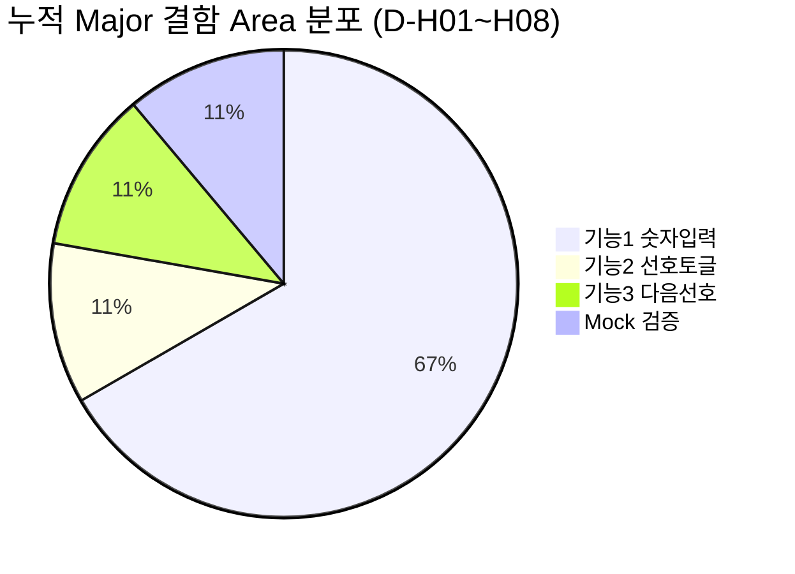

# QA 최종 보고서 — TDD TV Channel Controller

| 항목 | 내용 |
|------|------|
| 단계 | Step 9 — QA 종합 검토 |
| 역할 | QA 리드 엔지니어 |
| 작성 일시 | 2026-05-19 |
| 프로젝트 | C++17 · Google Test / GMock · CMake · gcov/lcov |
| 기준 | `README.md` TO-DO 28 시나리오, 목표 커버리지 **≥ 80%** |
| 연계 문서 | [`docs/requirements_analysis.md`](requirements_analysis.md), [`docs/test_plan.md`](test_plan.md), [`docs/defect_list.md`](defect_list.md), [`docs/defect_report.md`](defect_report.md), [`docs/golden_master_guide.md`](golden_master_guide.md), [`docs/refactoring_plan.md`](refactoring_plan.md) |

---

## Executive Summary

| 지표 | 목표 | 실측 (2026-05-19) | 판정 |
|------|------|-------------------|------|
| README 단위 시나리오 (T-01~T-28) | 28/28 | **28/28 (100%)** | ✅ |
| 테스트 실행 파일 (3+1) | 3 + Golden | **4/4** (`fake_tuner`, `controller`, `controller_mock`, `golden`) | ✅ |
| GTest 총 건수 | 28 (README) | **40** (6+17+5+12) | ✅ (Golden +12) |
| `ctest` (Windows) | Green | **4/4 Passed** | ✅ |
| 오픈 결함 | 0 | **0** | ✅ |
| `TVChannelController.cpp` 라인 커버리지 | ≥ 80% | **92.0%** (gcov/lcov) | ✅ |
| README `dev/refactoring` | Green 유지 | **미착수** (계획만 완료) | ⚠️ |

**종합 판정:** 기능·단위·Golden·Mock 검증은 README 요구를 충족한다. 인프라 결함(D-01)은 해결되었고, **lcov는 Step 9에서 최초 실측**하여 80% 목표를 달성했다. 리팩토링·CI 커버리지 게이트 자동화는 후속 과제로 남는다.

---

## 1. 테스트 완료율·커버리지

### 1.1 README 28 시나리오 대비 완료율

README TO-DO는 **FakeTuner 6 + Controller 17 + Mock 5 = 28건**이다.

| 영역 | README 건수 | 구현 테스트 | 통과 (실측) | 완료율 |
|------|:-----------:|:-----------:|:-----------:|:------:|
| FakeTunerTest | 6 | 6 `TEST` | 6/6 | 100% |
| TVChannelControllerTest — 기능1 | 8 | 8 `TEST_F` | 8/8 | 100% |
| TVChannelControllerTest — 기능2 | 4 | 4 `TEST_F` | 4/4 | 100% |
| TVChannelControllerTest — 기능3 | 5 | 5 `TEST_F` | 5/5 | 100% |
| TVChannelControllerMockTest | 5 | 5 `TEST_F` | 5/5 | 100% |
| **합계** | **28** | **28** | **28/28** | **100%** |

### 1.2 테스트 실행 파일 (3+1)

| # | CMake 타겟 | GTest | 검증 스타일 | Area |
|---|------------|:-----:|-------------|------|
| 1 | `fake_tuner_test` | 6 | 상태 (`FakeTuner`) | FakeTuner |
| 2 | `controller_test` | 17 | 상태 (`FakeTuner` + Controller) | 기능1~3 |
| 3 | `controller_mock_test` | 5 | 행위 (`MockTuner`, `EXPECT_CALL`) | Mock검증 |
| 4 | `golden_test` *(Step 6 추가)* | 12 | E2E 스냅샷 (`test/golden/*.approved.txt`) | 기능1~3 회귀 |
| | **합계** | **40** | | |

**검증 명령 (로컬, 2026-05-19 재실행):**

```powershell
cmake --build build
ctest --test-dir build --output-on-failure   # Windows: 4/4 Passed

.\build\fake_tuner_test.exe          # 6/6
.\build\controller_test.exe          # 17/17
.\build\controller_mock_test.exe     # 5/5
.\build\golden_test.exe              # 12/12
```

| 메트릭 | 값 |
|--------|-----|
| GTest 통과율 | **40/40 (100%)** |
| ctest 통과율 (Windows, exe 단위) | **4/4 (100%)** |
| CI (`.github/workflows/ci.yml`) | Ubuntu: `ctest` 4타겟 (per-case discover 가능) |

> **D-02 (Info):** Windows `ctest` **4/4**는 실행 파일 단위 통과이며, 내부 40 GTest를 대체하지 않는다. 품질 게이트 SSOT는 **직접 exe 합계 40/40**이다.

### 1.3 gcov / lcov 커버리지 (Step 9 최초 실측)

| 항목 | 내용 |
|------|------|
| 빌드 | MinGW GCC 15.2, `build_cov`, `-O0 --coverage` |
| 실행 | 4개 test exe 전부 실행 후 `lcov --capture` |
| 필터 | `test/`, `googletest`, `_deps`, MinGW 시스템 헤더 제외 |

#### SUT: `src/TVChannelController.cpp`

| 메트릭 | 목표 | 실측 |
|--------|:----:|:----:|
| **라인 (lines)** | ≥ 80% | **92.0%** (46/50 executable lines, gcov) |
| **함수 (functions)** | — | **100%** (6/6) |
| **분기 (branches, gcov)** | — | **86.2%** executed (참고) |

#### 라이브러리·헤더 포함 (`tv_controller` + public headers, lcov filtered)

| 파일 | 라인 | 함수 |
|------|:----:|:----:|
| `src/TVChannelController.cpp` | 92.0% | 100% |
| `include/TVChannelController.h` | 100% | 100% |
| `include/FakeTuner.h` | 100% | 100% |
| **Total (filtered)** | **94.0%** (78/83) | **95.5%** (21/22) |

#### 미커버·저커버 구간 (개선 후보)

| 위치 | 내용 | 권장 보완 |
|------|------|-----------|
| `applyChannel` L7 | `!isValidChannel(ch)` throw | 컨트롤러 단독 무효 채널 호출 테스트 (현재는 `FakeTuner`·`pressNumber` 경로로 예외 검증) |
| `pressNumber` L20 | 한 자리 버퍼에서 `next > 99` 즉시 throw | `pressNumber`로 2자리 조합 100+ 유도 (T-14는 `10` 보류 경로) |
| `pressNumber` L36–37 | 세 자리 입력 후 **유효** 채널(≤99) 적용 | 예: 버퍼 `10` + `5` → `105`가 아닌 `15` 등 시나리오 1건 |
| `TVChannelController.h` 인라인 | gcov 40% (헤더만) | 리팩토링 시 `.cpp`로 이동 시 재측정 |

**판정:** README **80%+** 목표 **달성**. 권장 90%에는 근접(92%)하나, 위 3분기 보완 시 여유 확보 가능.

**권장:** `CMakeLists.txt`에 `ENABLE_COVERAGE` 옵션·CI `ubuntu-latest` lcov 아티팩트 업로드를 추가해 Step 9 일회성 측정을 **재현 가능**하게 한다.

---

## 2. 결함 패턴 분석

### 2.1 Area × Severity — 현재 오픈

|  | FakeTuner | 기능1 | 기능2 | 기능3 | Mock | **합계** |
|--|:---------:|:-----:|:-----:|:-----:|:----:|:--------:|
| Critical | 0 | 0 | 0 | 0 | 0 | **0** |
| Major | 0 | 0 | 0 | 0 | 0 | **0** |
| Minor | 0 | 0 | 0 | 0 | 0 | **0** |
| Info | 0 | 0 | 0 | 0 | 0 | **0** |

| 전역(인프라) | Critical | Major | Info |
|--------------|:--------:|:-----:|:----:|
| 오픈 | 0 | 0 | 0 |

### 2.2 누적 발견·해결 (히스토리)

|  | FakeTuner | 기능1 | 기능2 | 기능3 | Mock | **고유 Major** |
|--|:---------:|:-----:|:-----:|:-----:|:----:|:--------------:|
| Major (해결) | 0 | 6 | 1 | 1† | 1† | **8건** (D-H01~H08) |
| Critical (해결) | — | — | — | — | — | D-01 |
| Info | — | — | — | — | — | D-02 |

† D-H08: 기능3 동작 실패와 Mock `setCH` 미호출이 동시 관측 (동일 스텁 원인).

| 전역 | 건수 | ID |
|------|:----:|-----|
| Critical | 1 (해결) | D-01 Windows CTest 거짓 Green |
| Info | 1 | D-02 ctest 28/28 vs 실제 검증 의미 |

### 2.3 패턴 요약



| 패턴 | 설명 | 교훈 |
|------|------|------|
| **스텁 집중 (Step 4 Red)** | 8/8 Major가 `TVChannelController` 스텁에서 동시 발생 | TDD Red 단계에서 Area별 실패가 **기능 미구현**임을 명확히 분리 기록 |
| **기능1 밀도** | D-H01~H06 (75%) — 입력 버퍼 상태 머신 | 가장 복잡한 도메인; 테스트를 Fake(상태) → Mock(계약) 순으로 층화한 것이 적절 |
| **FakeTuner 무결함** | Area 결함 0 | 테스트 더블을 먼저 검증(Phase A)한 전략이 유효 |
| **인프라 Critical** | D-01 — 테스트 0건 실행인데 Pass | **로케일·필터·CI 게이트**를 제품 결함과 동급으로 추적 |
| **Golden 무결함 (Step 6)** | 신규 결함 0 | 스냅샷 기준선이 회귀 안전망으로 동작 |

**결함 밀도 (히스토리):** 고유 ID 10건 / 검증 시나리오 40 ≈ **25%** (현재 오픈 0).

---

## 3. Tasks Step 1~9 효과성 평가

| Step | 활동 | 효과 | 개선 필요 |
|:----:|------|:----:|:---------:|
| **1** | 요구사항 분석 (`requirements_analysis.md`, T-01~T-28) | ★★★★★ | — |
| **2** | 코드 품질·SOLID (`code_quality_report.md`) | ★★★★☆ | 리팩토링 실행 전 분석만으로 종료 — Step 7과 **연계 실행** 필요 |
| **3** | 테스트 계획 (`test_plan.md`, Phase A~F) | ★★★★★ | `ENABLE_COVERAGE` CMake 반영 미완 |
| **4** | 단위 테스트 + Green 구현 | ★★★★★ | 초기 ctest 28/28 보고는 D-01 함정 (문서에 주의 문구 반영됨) |
| **5A** | 테스트 실패 디버깅 | ★★★★★ | D-01 조기 발견의 핵심 단계 |
| **5B** | 결함 목록 SSOT | ★★★★★ | `defect_list.md` ↔ Report 동기화 유지 |
| **6** | Golden Master (+12 시나리오) | ★★★★☆ | README 28건 외 확장 — **과제 범위 명시** 권장 |
| **7** | 리팩토링 **계획** | ★★★☆☆ | 계획만 존재, `clearBuffer` 등 **코드 미적용** |
| **8** | 결함 관리·메트릭 프로세스 | ★★★★☆ | lcov는 문서상 “미측정” → Step 9에서 보완 |
| **9** | QA 종합 (본 문서) | — | — |

### 3.1 가장 효과적이었던 단계 (Top 3)

1. **Step 1 + 3** — README TO-DO를 T-01~T-28·Phase A~F로 고정해 Red→Green 순서와 Test Double 역할을 명확히 함.
2. **Step 4 + 5A** — 스텁 Red → 구현 Green → **D-01(거짓 Green)** 발견. “ctest 통과 ≠ 품질” 교훈.
3. **Step 5B + 8** — Severity×Area 매트릭스·ID 체계로 스텁 시대 결함을 회귀 교육 자료로 보존.

### 3.2 개선이 필요한 단계 (Top 3)

1. **Step 7** — `docs/refactoring_plan.md` 10 Phase 중 **코드 변경 0%**. Green 유지 채널은 Golden 40건이 있으나 실행·커밋 분리 필요.
2. **Step 2 ↔ 7 간극** — SOLID 이슈( `pressNumber` SRP 등)가 분석만 있고 코드에 반영되지 않음.
3. **커버리지 게이트** — README·test_plan의 80%가 Step 9까지 **수동 일회 측정**. CI·CMake 옵션화 필요.

---

## 4. 다음 TDD·레거시 C++ 프로젝트 Best Practice 5가지

### BP-1. Test Double 분리 (Fake vs Mock)

| Test Double | 검증 대상 | 본 프로젝트 적용 |
|-------------|-----------|------------------|
| **Fake** (`FakeTuner`) | 최종 **상태** (채널 문자열, favorites) | `controller_test` 17건 — 비즈니스 규칙 SSOT |
| **Mock** (`MockTuner`) | **행위** (호출 횟수·순서·미호출) | `controller_mock_test` 5건 — `ITuner` 계약 고정 |

**규칙:** Fake로 기능을 Green한 뒤 Mock으로 협력 계약만 좁힌다. Mock만으로 상태까지 검증하지 않는다.

### BP-2. `ITuner` 의존성 주입 (생성자 `ITuner&`)

- 외부 제공 `ITuner.h` **수정 금지** 환경에서도 테스트 가능.
- 프로덕션은 실 튜너, 테스트는 Fake/Mock 주입 — **레거시 C++에 최소 침습** DI 패턴.

### BP-3. TDD Red → Green → Refactor (커밋 단위)

```text
Red:    README 시나리오 → 실패 테스트 (스텁 시 D-H01~H08)
Green:  최소 구현 (TVChannelController.cpp ~72 LOC)
Refactor: clearBuffer / findNextFavorite (본 프로젝트는 계획만 — 반드시 실행할 것)
```

각 단계마다 **40/40 (또는 28/28) Green**을 게이트로 삼는다.

### BP-4. Golden Master로 E2E 회귀 고정

- `.scenario` + `.approved.txt` + `ScenarioRunner` — UI 없이 **입력 시퀀스 → CH/FAV 덤프** 비교.
- 단위 테스트가 놓치기 쉬운 **복합 시퀀스**(12→★ 08→★ …)를 12건으로 보강.
- 리팩토링 시 Golden diff = **동작 변경 신호**.

### BP-5. 품질 게이트 3중화 (exe · ctest · lcov)

| 게이트 | 목적 |
|--------|------|
| 직접 `*_test.exe` | 실제 GTest assert 실행 (SSOT) |
| `ctest` | CI 통합 — **Windows 한글 필터 함정** 인지 (D-01) |
| lcov ≥ 80% | `tv_controller` 라인 — 미커버 분기 보완 루프 |

---

## 5. Cursor AI 활용 효과

본 프로젝트는 `tasks/step-*.md`·`Prompting/`·`docs/`·`Report/` 산출물과 Cursor 에이전트 워크플로를 통해 진행되었다. 초기 [`docs/review_report.md`](review_report.md)는 테스트 시나리오 **0/28 (0%)** 스캐폴딩 상태를 기록했으며, 최종 실측은 **28/28 + Golden 12 + lcov 92%**이다.

### 5.1 정량 요약

| 지표 | 스캐폴딩(초기 리뷰) | 최종 (Step 9) | 변화 |
|------|---------------------|---------------|------|
| README 시나리오 통과 | 0/28 | 28/28 | +100%p |
| GTest 총계 | ~3 스텁 | 40/40 | +37건 실질 검증 |
| 오픈 결함 | 다수(스텁) | 0 | — |
| `TVChannelController.cpp` lcov | 미측정 | **92%** | 목표 80% 초과 |
| 구조화 QA 문서 | 0 | 15+ (`docs/` + `Report/`) | — |
| 인프라 결함 발견 | — | D-01 (Critical) | AI 보조 루트원인 분석 |

| 활동 영역 | 추정 시간 절감* | 근거 |
|-----------|:---------------:|------|
| 요구사항·테스트 플랜 표 작성 | **50~70%** | T-01~T-28, Phase 표 자동 초안 |
| Red→Green 구현·테스트 코드 | **40~60%** | 28 시나리오 + 픽스처·Mock 보일러플레이트 |
| 결함 분석·CMake 수정 (D-01) | **60%+** | `LastTest.log` + UTF-8 필터 패턴 즉시 특정 |
| Golden / 결함 문서 템플릿 | **50%** | 시나리오·매트릭스·SSOT 연계 |
| lcov 1회 측정·해석 | **30%** | MinGW coverage 빌드·미커버 라인 요약 |

\*동일 숙련도 개발자가 수동으로 C++ TDD 전 과정을 수행한다는 가정下的 추정치이며, 공식 벤치마크는 아니다.

### 5.2 정성 요약

| 강점 | 설명 |
|------|------|
| **조기 결함 발견** | D-01처럼 “통과하지만 검증하지 않음” 클래스를 Step 5A에서 분리 |
| **문서·코드 정합** | `requirements_analysis` ↔ `test_plan` ↔ `defect_list` ID 연계 |
| **커버리지 가시성** | 미측정 상태를 Step 8에서 명시 → Step 9에서 gcov 실행·92% 확인 |
| **교육용 회귀 자료** | D-H01~H08 스텁 결함 카드가 TDD Red 교육에 재사용 가능 |

| 리스크·완화 | 설명 |
|-------------|------|
| **거짓 Green 오인** | ctest만 신뢰 → **직접 exe 40/40** SSOT (D-02) |
| **문서·실행 괴리** | Step 7 리팩토링 “계획만 완료” → 실행 체크리스트를 PR 게이트에 포함 |
| **과도한 산출물** | `docs/` vs `Report/` 이중화 → SSOT 경로를 README에 1줄 명시 |

---

## 6. 잔여 과제·권장 종료 조건

| 우선순위 | 항목 | 담당 |
|:--------:|------|------|
| P1 | `ENABLE_COVERAGE` + CI lcov 아티팩트 | DevOps |
| P1 | Step 7 리팩토링 Phase 1~3 실행 (`clearBuffer`, `findNextFavorite`) | Dev |
| P2 | 미커버 3분기 테스트 보완 (§1.3) | QA |
| P2 | README에 “Windows ctest = 4 executable” 명시 (D-02) | QA |
| P3 | `addFavorite` 테스트 헬퍼 vs 프로덕션 중복 제거 | Dev |

---

## 7. 결론

TDD TV Channel Controller 프로젝트는 **README 28 시나리오 100% 통과**, **4개 테스트 실행 파일·40 GTest Green**, **오픈 결함 0건**, **`TVChannelController.cpp` 라인 커버리지 92% (80% 목표 초과)** 로 기능 QA를 종료할 수 있다.

Step 1·3·4·5A·5B·6·8은 과제 목표 달성에 **핵심적**이었고, Step 7(리팩토링 실행)과 **CI 커버리지 자동화**는 다음 스프린트 또는 동일 레포 후속 작업으로 이관하는 것이 적절하다.

Cursor AI는 요구사항 정리·테스트·결함 분석·문서화 cycle을 단축했으며, 특히 **D-01 인프라 Critical** 조기 발견은 수동 QA만으로는 누락되기 쉬운 유형이다. **직접 gtest exe 실행 + lcov**를 사람·CI 양쪽 게이트에 고정하는 것이 본 프로젝트의 핵심 교훈이다.

---

## 부록 A. 검증 로그 스냅샷 (2026-05-19)

```
ctest: 4/4 Passed (fake_tuner_test, controller_test, controller_mock_test, golden_test)
GTest: 6 + 17 + 5 + 12 = 40/40 Passed
lcov (filtered, tv_controller 관련): lines 94.0%, functions 95.5%
gcov TVChannelController.cpp: lines 92.0%, branches 86.2%
```

## 부록 B. 참조 산출물

| 문서 | 경로 |
|------|------|
| 요구사항 분석 | `docs/requirements_analysis.md` |
| 테스트 계획 | `docs/test_plan.md` |
| 결함 목록 (SSOT) | `docs/defect_list.md` |
| 결함 관리·메트릭 | `docs/defect_report.md` |
| Golden Master 가이드 | `docs/golden_master_guide.md` |
| 리팩토링 계획 | `docs/refactoring_plan.md` |
| 초기 QA 리뷰 (스캐폴딩) | `docs/review_report.md` |
