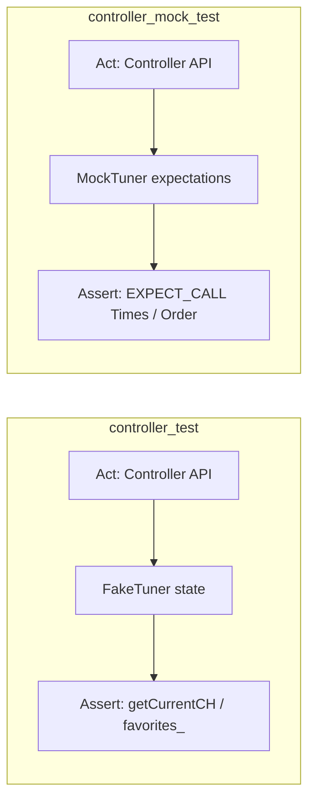

# TDD TV Channel Controller — 테스트 계획서

| 항목 | 내용 |
|------|------|
| 역할 | 시니어 QA 리드 |
| 프로젝트 | TDD TV Channel Controller (C++17, CMake, Google Test / GMock) |
| 기준 문서 | `README.md` TO-DO 28건, `docs/requirements_analysis.md` (T-01~T-28) |
| SUT | `FakeTuner`, `TVChannelController` (`src/TVChannelController.cpp` — 현재 스텁) |
| 커버리지 목표 | README **≥ 80%** 라인 · 권장 **≥ 90%** (`TVChannelController.cpp` 분기) |
| 측정 | gcov + lcov (가능 시 CMake 옵션으로 통합) |

---

## 1. 단위 테스트 범위·우선순위

### 1.1 CMake 실행 파일·검증 범위

| 순서 | CMake 타겟 | 소스 | SUT / 범위 | Test Double | 검증 스타일 |
|------|------------|------|------------|-------------|-------------|
| **1** | `fake_tuner_test` | `test/FakeTunerTest.cpp` | `FakeTuner` 단독 | — | **상태** (`getCurrentCH`, 예외) |
| **2** | `controller_test` | `test/TVChannelControllerTest.cpp` | `TVChannelController` + 튜너 통합 | `FakeTuner` | **상태** (최종 채널·`favorites_`) |
| **3** | `controller_mock_test` | `test/TVChannelControllerMockTest.cpp` | 컨트롤러 ↔ `ITuner` 협력 | `MockTuner` | **행위** (`EXPECT_CALL`, `InSequence`) |

현재 `CMakeLists.txt`는 위 3타겟·`gtest_discover_tests` 등록이 완료되어 있다. 커버리지 플래그는 **Phase F**(§5)에서 옵션으로 추가한다.

### 1.2 TDD Red → Green 진행 순서

과제는 **테스트 선행(Red) → 최소 구현(Green)** 을 파일·기능 단위로 진행한다. Mock 테스트는 컨트롤러가 Fake 테스트로 기능이 맞춰진 뒤 **협력 계약**을 고정하는 용도로 둔다.

```text
Phase A  fake_tuner_test     T-01 ~ T-06   FakeTuner 경계·seekCH wrap
Phase B  controller_test     T-07 ~ T-14   기능 1: 숫자·확정·Other·예외
Phase C  controller_test     T-15 ~ T-18   기능 2: 선호 토글·정렬
Phase D  controller_test     T-19 ~ T-23   기능 3: next favorite·wrap
Phase E  controller_mock_test T-24 ~ T-28  setCH 횟수·순서·미호출
Phase F  (리팩토링 브랜치)   lcov ≥ 80%    미커버 분기 보완 → 90% 권장
```

**우선순위 요약**

| 등급 | 범위 | 이유 |
|------|------|------|
| **P0** | T-01~T-04, T-07~T-08, T-14 | 튜너·컨트롤러 **계약 핵심**(경계·두 자리·예외) |
| **P1** | T-05~T-06, T-09~T-13, T-15~T-21, T-24~T-26, T-28 | README 명세 전체·Mock 기본 5건 |
| **P2** | T-17, T-22~T-23, T-27 | 복합 시퀀스·목록 외·호출 순서 |

### 1.3 `TEST` vs `TEST_F` 사용 기준

| 파일 | 패턴 | 적용 기준 |
|------|------|-----------|
| `FakeTunerTest.cpp` | **`TEST` 위주** | 픽스처 공유 불필요; `FakeTuner({1,4,12,56})` 로컬 생성 |
| `TVChannelControllerTest.cpp` | **`TEST_F(ControllerTest, ...)`** | `FakeTuner` + `TVChannelController` + 초기 `setCH("0")` 반복 제거 |
| `TVChannelControllerMockTest.cpp` | **`TEST_F(MockControllerTest, ...)`** | `ON_CALL` 기본값·`StrictMock`·`InSequence` 공통 |

**픽스처 예시 (리팩토링 TODO: SetUp 통합)**

```cpp
class ControllerTest : public ::testing::Test {
protected:
    FakeTuner tuner{std::vector<int>{1, 4, 12, 56}};
    TVChannelController ctrl{tuner};

    void SetUp() override { tuner.setCH("0"); }
};
```

**`ASSERT_*` vs `EXPECT_*`**

| 매크로 | 용도 |
|--------|------|
| `ASSERT_*` | 이후 Act/Assert가 무의미해지는 **전제**(Arrange 실패, 포인터 null) |
| `EXPECT_*` | **결과 검증**(채널 문자열, favorites, `EXPECT_THROW`) |

### 1.4 파일별 테스트 건수·현재 상태

| 파일 | 계획 | 현재 |
|------|------|------|
| `FakeTunerTest.cpp` | 6 (`TEST`) | 1 스텁 (`Stub`) |
| `TVChannelControllerTest.cpp` | 17 (`TEST_F`) | 1 스텁 |
| `TVChannelControllerMockTest.cpp` | 5 (`TEST_F`) | 1 스텁 |
| **합계** | **28** | **3** — T-01~T-28 **미착수** |

---

## 2. 경계값 케이스 목록

### 2.1 채널 정수·문자열 (0~99)

| ID | 값 | 경계 의미 | 검증 위치 | 시나리오 |
|----|-----|-----------|-----------|----------|
| B-CH-00 | **0** | 최솟값 | Fake `setCH` / Controller | T-01, T-12 |
| B-CH-01 | **1** | 최소 양수·한 자리 | Controller | T-07 (`1`+Confirm → `"1"`) |
| B-CH-98 | **98** | 상한 직전 (확장) | Controller | `9`,`8` 또는 `addFavorite`+이동 — **권장 보완** |
| B-CH-99 | **99** | 최댓값 | Fake / Controller | T-02, T-13 (`9`,`9`) |
| B-CH--1 | **-1** | 무효 하한 | Fake `setCH("-1")` | T-03 → `invalid_argument` |
| B-CH-100 | **100** | 무효 상한 | Fake / Controller | T-04, T-14 (`1`,`0`,`0`) |

**인접 경계 조합 (기능 1)**

| 입력 시퀀스 | 산술값 | 기대 |
|-------------|--------|------|
| `0` + Confirm | 0 | `"0"` (T-12) |
| `0`, `7` | 7 | `"7"` (T-11, 선행 0 소멸) |
| `9`, `9` | 99 | `"99"` (T-13) |
| `9`, `8` | 98 | `"98"` (B-CH-98 확장) |
| `1`, `0`, `0` | 100 | 예외 (T-14) |

### 2.2 숫자 버튼 `pressNumber(digit)` — digit 0~9

| digit | 역할 예시 | 관련 시나리오 |
|-------|-----------|---------------|
| 0 | 선행 0·채널 0 | T-11, T-12 |
| 1~8 | 일반 두 자리 조합 | T-07~T-10, T-19 |
| 9 | `99` 상한 구성 | T-13 |

과제 범위: `digit`은 **0~9만** 유효 입력으로 가정. 범위 외는 구현 선택(무동작 vs `invalid_argument`)이며, **P2 확장**으로 한 건만 정의해 두면 분기 커버에 유리하다.

### 2.3 `inputBuffer_` 상태

| 값 | 의미 | 검증 |
|----|------|------|
| **-1** | Idle — 입력 없음 | 첫 `pressNumber` 후에만 버퍼 채움; `pressConfirm` on Idle → 무동작 (F1-10) |
| **0~9** | 한 자리 대기 | 두 번째 `pressNumber` 또는 `pressConfirm` / `pressOther` |

| 전이 | Act | `inputBuffer_` after | 튜너 |
|------|-----|----------------------|------|
| Idle → Buffered | `pressNumber(4)` | `4` | 변화 없음 |
| Buffered → Idle (적용) | `pressNumber(5)` | `-1` | `"45"` 즉시 |
| Buffered → Idle (무효화) | `pressOther()` | `-1` | 이전 채널 유지 (T-10) |
| Buffered → Idle (확정) | `pressConfirm()` | `-1` | 한 자리 적용 (T-07) |

### 2.4 `favorites_` 크기·wrap-around

| ID | `favorites_` | 현재 채널 | 기대 | 시나리오 |
|----|--------------|-----------|------|----------|
| B-FAV-0 | `{}` (빈) | 임의 | 채널 **변화 없음** | T-21, T-28 |
| B-FAV-1 | `{12}` 1개 | `12` | next → `"12"` (wrap, 동일) | T-23 |
| B-FAV-N | `{1,4,12,56}` | `6` | next → `"12"` | T-19 |
| B-FAV-N | 동일 | `56` | wrap → `"1"` | T-20 |
| B-FAV-외 | `{1,4,12,56}` | `6` (∉ 목록) | `upper_bound` → `12` | T-22 |

### 2.5 `FakeTuner::seekCH` wrap-around

| 단계 | `available_` | `current_` | `seekCH()` 결과 |
|------|--------------|------------|-----------------|
| 초기 | `{1,4,12,56}` | 0 | `"1"` |
| 연속 | 동일 | 마지막 이후 | `available_.front()` (T-06) |
| 유효성 | — | — | 연속 호출 반환값 ∈ [0,99] (T-05) |

`available_`는 **비어 있지 않음**을 전제한다(빈 벡터 시 `front()` UB — 테스트에서 금지).

---

## 3. 예외·특이 케이스 목록

### 3.1 예외 (`std::invalid_argument`)

| ID | 트리거 | 발생 경로 | 테스트 |
|----|--------|-----------|--------|
| E-01 | `setCH("-1")` | `FakeTuner::setCH` | T-03 `EXPECT_THROW` |
| E-02 | `setCH("100")` | `FakeTuner::setCH` | T-04 |
| E-03 | `pressNumber(1,0,0)` → 100 | `applyChannel` → `tuner_.setCH` | T-14 (전파) |
| E-04 | `applyChannel` / `isValidChannel` false | 컨트롤러 단독(구현 시) | T-14와 동일 계약 |

예외 메시지에 채널 문자열 포함 여부는 Fake·README와 **동일 계약**으로 맞춘다.

### 3.2 버퍼·입력 특이

| ID | 시나리오 | 기대 | 테스트 |
|----|----------|------|--------|
| E-05 | `4`,`5`,`6` 후 `pressOther()` | `"45"` 유지, `6` 미적용 | T-10 |
| E-06 | 두 자리 **즉시** vs **확정** | `1`,`2`→`"12"` / `1`+Confirm→`"1"` | T-08, T-07 |
| E-07 | `pressConfirm()` on Idle (`inputBuffer_==-1`) | 튜너 무변경 | F1-10 (P2 보완) |
| E-08 | 연속 4자리 `1,2,3,4` | `"12"` → `"34"` | T-09 |

### 3.3 선호 채널·다음 채널 특이

| ID | 시나리오 | 기대 | 테스트 |
|----|----------|------|--------|
| E-09 | 미등록 `pressFavorite()` | 목록 추가 | T-15 |
| E-10 | 등록 후 재 `pressFavorite()` | 목록에서 **삭제** | T-16 |
| E-11 | `12→★ 08→★ 37→★ 08→★ 06→★` | `{6,12,37}` | T-17 |
| E-12 | 현재 채널 ∉ `favorites_` | 다음 큰 값 또는 wrap | T-22 |
| E-13 | `getFavoriteChannels()` | 항상 오름차순 | T-18 |

### 3.4 Mock — 미호출·순서·과호출

| ID | 시나리오 | GMock 기대 | 테스트 |
|----|----------|------------|--------|
| E-M01 | `pressNextFavorite`, 빈 favorites | `setCH` **0회** | T-28 `Times(0)` |
| E-M02 | `pressNextFavorite`, 목록 있음 | `getCurrentCH` **후** `setCH` | T-27 `InSequence` |
| E-M03 | `pressFavorite` | `getCurrentCH` ≥1회 | T-26 |
| E-M04 | `pressNumber`+`pressConfirm` | `setCH("1")` **정확히 1회** | T-24 |
| E-M05 | `pressNumber(1,2)` | `setCH("12")` **1회**, Confirm 없음 | T-25 |
| E-M06 | 컨트롤러 시나리오 전반 | `seekCH` **미기대** | strict mock 시 기본 미설정 |

---

## 4. Fake vs Mock 검증 분리 전략

### 4.1 역할 분담



| 구분 | Fake (`FakeTuner` + `controller_test`) | Mock (`MockTuner` + `controller_mock_test`) |
|------|----------------------------------------|-----------------------------------------------|
| 검증 대상 | **무엇이 바뀌었는가**(최종 상태) | **어떻게 협력했는가**(호출) |
| Assert 예 | `EXPECT_EQ(tuner.getCurrentCH(), "12")` | `EXPECT_CALL(mock, setCH("12")).Times(1)` |
| 예외 | `EXPECT_THROW(ctrl..., invalid_argument)` | Fake 쪽에서 주로 검증 |
| favorites 내용 | `getFavoriteChannels()` 전체 비교 | **검증하지 않음** |
| `seekCH` | `FakeTunerTest` 전용 | 컨트롤러 Mock 테스트에서 **기대하지 않음** |

**중복 금지:** T-07/T-08과 T-24/T-25는 **동일 사용자 시나리오**이나, Fake는 결과·Mock은 **호출 계약**만 검증한다. Mock에 favorites 정렬을, Fake에 `Times(1)` 남용을 하지 않는다.

### 4.2 GMock 패턴 (행위 기반)

**기본 Arrange — `ON_CALL` + 검증 대상만 `EXPECT_CALL`**

```cpp
class MockControllerTest : public ::testing::Test {
protected:
    MockTuner mockTuner;
    TVChannelController ctrl{mockTuner};

    void SetUp() override {
        using ::testing::Return;
        ON_CALL(mockTuner, getCurrentCH()).WillByDefault(Return("0"));
    }
};
```

**T-24 — 횟수**

```cpp
using ::testing::_;
EXPECT_CALL(mockTuner, setCH("1")).Times(1);
ctrl.pressNumber(1);
ctrl.pressConfirm();
```

**T-27 — 순서 (`InSequence`)**

```cpp
using ::testing::InSequence;
using ::testing::Return;
InSequence seq;
EXPECT_CALL(mockTuner, getCurrentCH()).WillOnce(Return("6"));
EXPECT_CALL(mockTuner, setCH("12")).Times(1);
// Arrange: ctrl.addFavorite(1); addFavorite(4); ... 또는 pressFavorite 시퀀스
ctrl.pressNextFavorite();
```

**T-28 — 미호출**

```cpp
using ::testing::_;
EXPECT_CALL(mockTuner, setCH(_)).Times(0);
ctrl.pressNextFavorite();
```

`StrictMock<MockTuner>` 사용 시, 검증하지 않는 메서드는 `ON_CALL`로 기본 동작을 반드시 정의한다.

### 4.3 Fake 상태 기반 Arrange 팁

| 시나리오 | Arrange |
|----------|---------|
| T-19 | `tuner.setCH("6");` + `ctrl.addFavorite(1);` … 또는 `pressFavorite` 시퀀스 |
| T-10 | `4`,`5` 입력 후 `6` 입력 직전·직후 `getCurrentCH()` 스냅샷 |
| T-17 | 채널 이동 후 `pressFavorite` 반복 — README 화살표 시퀀스 그대로 |

---

## 5. 커버리지 목표·gcov/lcov 측정·개선 전략

### 5.1 목표

| 지표 | README | 권장 | 측정 대상 |
|------|--------|------|-----------|
| 라인 커버리지 | **≥ 80%** | **≥ 90%** | `src/TVChannelController.cpp` |
| 분기 커버리지 | — | 가능 시 확인 | `pressNumber` / `pressNextFavorite` / `pressFavorite` |
| 제외 | — | — | `test/*`, FetchContent googletest, 시스템 헤더 |

### 5.2 CMake·빌드 (gcov 가능 시)

MinGW/GCC(Linux, WSL, MSYS2) 예시 — `CMakeLists.txt`에 옵션 추가:

```cmake
option(ENABLE_COVERAGE "Build with coverage" OFF)
if(ENABLE_COVERAGE)
    add_compile_options(--coverage -O0 -g)
    add_link_options(--coverage)
endif()
```

```bash
cmake -B build -DENABLE_COVERAGE=ON
cmake --build build
cd build && ctest --output-on-failure
```

**Windows MSVC:** 기본 gcov 미지원 → WSL/MinGW 빌드 또는 OpenCppCoverage 등 대안. 과제 README는 gcov/lcov를 **가능 시** 포함으로 명시.

### 5.3 lcov 파이프라인

```bash
lcov --capture --directory build --output-file coverage.info
lcov --remove coverage.info '/usr/*' '*/test/*' '*/googletest/*' '*/build/_deps/*' \
     --output-file coverage.filtered.info
genhtml coverage.filtered.info --output-directory build/coverage_html
```

### 5.4 미커버 라인 → 테스트 보완 매핑

| 예상 미커버 분기 | 보완 시나리오 | ID |
|------------------|---------------|-----|
| `pressConfirm` + Idle | Confirm만 호출, 채널 동일 | E-07 |
| `pressFavorite` erase 분기 | 등록 후 재토글 | T-16 |
| `pressNextFavorite` wrap | 현재 56 → 1 | T-20 |
| `pressNextFavorite` 단일 원소 | fav `{12}` only | T-23 |
| `applyChannel` invalid | `1,0,0` | T-14 |
| `isValidChannel` false 직접 | (private) T-14 간접 | T-14 |
| 채널 98 | `9`,`8` | B-CH-98 |

**개선 루프:** lcov HTML → 미커버 라인 식별 → P2 보완 테스트 1건 추가 → Green 유지 → 80% 확인 → 90% 권장까지 반복 (README dev/refactoring 체크리스트).

---

## 6. README TO-DO 28건 추적 매트릭스

### 6.1 FakeTunerTest.cpp (6건)

| ID | P | 권장 `TEST` 이름 | README 요약 | Act | Assert |
|----|---|------------------|-------------|-----|--------|
| T-01 | P0 | `SetCH_MinBoundary_ReturnsZero` | `setCH("0")` | `setCH("0")` | `getCurrentCH()=="0"` |
| T-02 | P0 | `SetCH_MaxBoundary_Returns99` | `setCH("99")` | `setCH("99")` | `=="99"` |
| T-03 | P0 | `SetCH_Negative_ThrowsInvalidArgument` | `setCH("-1")` | `setCH("-1")` | `EXPECT_THROW(..., invalid_argument)` |
| T-04 | P0 | `SetCH_100_ThrowsInvalidArgument` | `setCH("100")` | `setCH("100")` | 동일 |
| T-05 | P1 | `SeekCH_Repeated_AlwaysValidChannel` | seek 연속 | `seekCH()` N회 | 반환값 0~99 |
| T-06 | P1 | `SeekCH_AtEnd_WrapsToFirst` | wrap | 끝까지 seek + 1회 | 첫 `available_` 채널 |

### 6.2 TVChannelControllerTest.cpp — 기능 1 (8건)

| ID | P | 권장 `TEST_F` 이름 | README 요약 |
|----|---|-------------------|-------------|
| T-07 | P0 | `PressNumber_ThenConfirm_SetsSingleDigit` | `1`+Confirm → `"1"` |
| T-08 | P0 | `PressNumber_Twice_AppliesTwoDigits` | `1`,`2` → `"12"` |
| T-09 | P1 | `PressNumber_FourDigits_Applies12Then34` | `1,2,3,4` |
| T-10 | P1 | `PressOther_ClearsBuffer_KeepsChannel` | `4,5,6`+Other |
| T-11 | P1 | `PressNumber_LeadingZero_AppliesSeven` | `0`,`7` → `"7"` |
| T-12 | P1 | `PressNumber_ChannelZero_Applies` | 채널 0 |
| T-13 | P1 | `PressNumber_Channel99_Applies` | 채널 99 |
| T-14 | P0 | `PressNumber_Channel100_Throws` | 100+ 예외 |

### 6.3 TVChannelControllerTest.cpp — 기능 2·3 (9건)

| ID | P | 권장 `TEST_F` 이름 | README 요약 |
|----|---|-------------------|-------------|
| T-15 | P1 | `PressFavorite_NotInList_Adds` | 미등록 → 추가 |
| T-16 | P1 | `PressFavorite_InList_Removes` | 토글 삭제 |
| T-17 | P2 | `PressFavorite_Sequence_FinalList637` | `{6,12,37}` |
| T-18 | P1 | `GetFavoriteChannels_AlwaysSorted` | 정렬 |
| T-19 | P1 | `PressNextFavorite_From6_GoesTo12` | cur 6 → 12 |
| T-20 | P1 | `PressNextFavorite_From56_WrapsTo1` | wrap |
| T-21 | P1 | `PressNextFavorite_EmptyList_NoChange` | 빈 목록 |
| T-22 | P2 | `PressNextFavorite_CurrentNotInList_GoesNext` | 목록 외 |
| T-23 | P2 | `PressNextFavorite_SingleItem_Wraps` | 1개 wrap |

### 6.4 TVChannelControllerMockTest.cpp (5건)

| ID | P | 권장 `TEST_F` 이름 | README 요약 | 핵심 Expectation |
|----|---|-------------------|-------------|------------------|
| T-24 | P1 | `Confirm_CallsSetCHOnce` | Confirm → `setCH("1")`×1 | `Times(1)` |
| T-25 | P1 | `TwoDigits_CallsSetCH12Once` | `12` → `setCH("12")`×1 | `Times(1)` |
| T-26 | P1 | `PressFavorite_CallsGetCurrentCH` | Favorite | `getCurrentCH` 호출 |
| T-27 | P2 | `PressNextFavorite_CallsGetThenSet_InOrder` | next fav | `InSequence` |
| T-28 | P1 | `PressNextFavorite_Empty_NoSetCH` | 빈 목록 | `setCH` `Times(0)` |

### 6.5 요구사항 ID ↔ 테스트 교차 참조

| 요구사항 (requirements_analysis) | 테스트 ID |
|----------------------------------|-----------|
| F1-01 ~ F1-10 | T-07 ~ T-14, E-07 |
| F2-01 ~ F2-04 | T-15 ~ T-18 |
| F3-01 ~ F3-06 | T-19 ~ T-23, T-28 |
| FT-01 ~ FT-06 | T-01 ~ T-06 |
| MK-01 ~ MK-06 | T-24 ~ T-28 |

---

## 7. 테스트 실행·완료 기준

### 7.1 실행

```bash
cmake -B build
cmake --build build
ctest --test-dir build --output-on-failure
# 또는 개별
build/fake_tuner_test
build/controller_test
build/controller_mock_test
```

### 7.2 Definition of Done (dev 브랜치)

- [ ] T-01 ~ T-28 전부 **Green**
- [ ] 3 실행 파일 CTest 등록·CI(해당 시) 통과
- [ ] Fake: 상태·예외·favorites; Mock: 5건 협력 계약
- [ ] lcov **≥ 80%** (리팩토링 브랜치), 권장 90%
- [ ] 테스트명 `동작_조건_기대결과`, AAA 주석 (README refactoring TODO)

---

## 8. 현재 코드베이스 스냅샷

| 구성요소 | 상태 |
|----------|------|
| `FakeTuner.h` | 구현 완료 (경계·seek wrap) |
| `MockTuner.h` | `MOCK_METHOD` 3개 |
| `TVChannelController.cpp` | public API·`applyChannel` **스텁** |
| 테스트 | 각 파일 **Stub 1건** — 본 계획 기준 Red 착수 대기 |

본 계획서는 `docs/requirements_analysis.md`의 T-01~T-28 및 README TO-DO 테스트 항목과 **1:1 추적**한다. TDD 진행 시 **Phase A(P0)부터 Red → Green** 순으로 적용한다.
